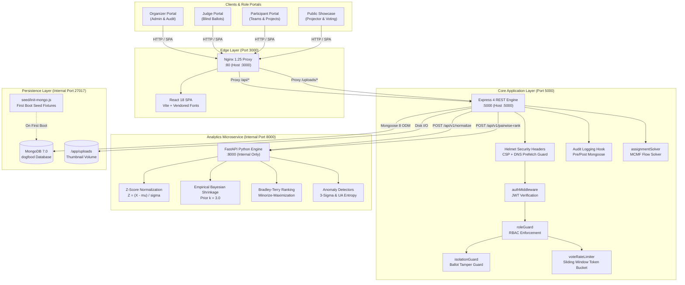

# DogFood 2026 Architecture

Technical architecture specification for the DogFood 2026 hackathon management, submission, judging, and community platform on the `main` branch.

---

## 1. System Overview

DogFood 2026 is a self-hosted, offline-first web platform engineered to manage the complete lifecycle of collegiate and regional hackathons. The system supports participant registration, team formation, project drafting and finalization, constraint-satisfied judge assignment, blind ballot scoring, statistical score normalization, community voting, and head-to-head pairwise ranking.

### Major Architectural Goals
1. **Self-Hosted Autonomy**: Provide a fully operational tournament environment running locally on consumer or server hardware with a single orchestration command.
2. **Offline Runtime Operation**: Eliminate external third-party CDN, font, and API dependencies during execution so the platform functions continuously across disconnected or private local-area networks.
3. **Impartial Evaluation via Statistical Normalization**: Mitigate severe judge calibration discrepancies (harsh vs. lenient graders) using empirical Bayesian shrinkage and Z-score transformations.
4. **Backend-Enforced Ballot Isolation**: Ensure judges evaluate projects blindly without viewing peer scores or competitor evaluations before final standings are published.
5. **Sybil-Resistant Community Engagement**: Provide public showcase voting protected by sliding-window token-bucket rate limiting and device fingerprinting.

---

## 2. Runtime Topology

The system is deployed using Docker Compose across four containers on a single user-defined bridge network (`dogfood-net`, `172.28.0.0/16`).

```
+----------------------------------------------------------------------------------------------------+
|                                         HOST BROWSER / CLIENT                                      |
+----------------------------------------------------------------------------------------------------+
              | :3000 (HTTP)                                          | :5000 (HTTP)
              v                                                       v
+-----------------------------+                         +-----------------------------+
|      dogfood-frontend       |                         |         dogfood-api         |
|  (Nginx 1.25 + React 18)    |--- /api/* Proxy ------> |   (Node.js 20 + Express 4)  |
|  Host: 3000 -> Container: 80|                         | Host: 5000 -> Container:5000|
+-----------------------------+                         +-----------------------------+
                                                                      |
                                       +------------------------------+------------------------------+
                                       | http://judging-service:8000                                 | mongodb://mongodb:27017/dogfood
                                       v                                                             v
                        +-----------------------------+                               +-----------------------------+
                        |       dogfood-judging       |                               |       dogfood-mongodb       |
                        |   (Python 3.11 + FastAPI)   |                               |        (MongoDB 7.0)        |
                        |  Internal Port: 8000 ONLY   |                               |  Internal Port: 27017 ONLY  |
                        +-----------------------------+                               +-----------------------------+
```

### Service Inventory

| Service Key | Container Name | Runtime / Base Image | Exposed Port (Host) | Internal Port | Primary Responsibility | Inter-Service Communication |
|---|---|---|---|---|---|---|
| `frontend` | `dogfood-frontend` | Nginx 1.25 Alpine / React 18 SPA | `3000:80` | `80` | Serves compiled React 18 static bundle; reverse-proxies `/api/` and `/uploads/` to `api:5000`. | Proxies API traffic to `http://api:5000/api/` and thumbnail requests to `http://api:5000/uploads/`. |
| `api` | `dogfood-api` | Node.js 20 Alpine / Express 4 | `5000:5000` | `5000` | REST API core, authentication, team lifecycle, score submissions, role/isolation enforcement, and audit logs. | Communicates with `mongodb:27017` via Mongoose and `judging-service:8000` via Axios HTTP client. |
| `judging-service` | `dogfood-judging` | Python 3.11 Slim / FastAPI + Uvicorn | *None* | `8000` | Microservice executing pure mathematical routines: Z-score normalization, Bayesian shrinkage, Bradley-Terry ranking, and anomaly detection. | Inbound HTTP only from `dogfood-api` via internal Docker network (`http://judging-service:8000`). |
| `mongodb` | `dogfood-mongodb` | MongoDB 7.0 | *None* | `27017` | Persistent document storage for users, teams, submissions, rubrics, scores, audit trails, and cache records. | Inbound TCP only from `dogfood-api` (`mongodb://mongodb:27017/dogfood`). |

### Host-Exposed vs. Internal-Only Services
- **Host-Exposed**:
  - `dogfood-frontend` maps host port `3000` to container port `80`.
  - `dogfood-api` maps host port `5000` to container port `5000`.
- **Internal-Only**:
  - `dogfood-judging` listens strictly on `0.0.0.0:8000` inside `dogfood-net` with no host port binding. Host browsers cannot connect to port 8000 directly.
  - `dogfood-mongodb` listens on `0.0.0.0:27017` inside `dogfood-net` with no host port binding. Direct database connections from host tools are blocked unless explicitly forwarded.

---

## 3. Request Flow

### 1. Participant Authentication
```
Browser -> Nginx (:3000) -> Express API (:5000) -> MongoDB (:27017)
```
1. Client POSTs credentials to `/api/v1/auth/login` (or `/api/v1/auth/register`).
2. Express calls `authController.login`.
3. Mongoose queries `User` collection selecting `+passwordHash`.
4. Password verified via `bcrypt.compare`.
5. Server signs JWT access token (1h expiration) and issues HTTP-only refresh cookie (`jwt`).
6. Response body returns `{ success: true, token, user }`. Frontend stores JWT in `localStorage` and `AuthContext`.

### 2. Team & Submission Workflow
```
Browser -> Nginx (:3000) -> Express API (:5000) -> Disk Storage / MongoDB (:27017)
```
1. **Team Creation**: Participant POSTs `{ name, track }` to `/api/v1/teams`. Server verifies user is not already in a team, generates a 6-character alphanumeric `joinCode`, and saves a new `Team` document with user as `captain`.
2. **Team Join**: Another participant POSTs `{ joinCode }` to `/api/v1/teams/join`. Server validates team has fewer than 4 members, appends member to `Team.members`, and sets `User.teamId`.
3. **Draft Submission**: Team member POSTs project details to `/api/v1/submissions`. Upserts draft in `Submission` linked to `Team._id`.
4. **Thumbnail Upload**: Client POSTs `multipart/form-data` to `/api/v1/submissions/upload-thumbnail`. Multer writes image to `/app/uploads/thumbnails/` and returns URL path `/uploads/thumbnails/<filename>`.
5. **Finalization**: Captain POSTs to `/api/v1/submissions/finalize`. Status transitions to `submitted`, locking edits and updating `Team.hasSubmitted = true`.

### 3. Judge Queue Retrieval
```
Judge Browser -> Express API (:5000) -> MongoDB (:27017)
```
1. Judge navigates to `/judging`, triggering `GET /api/v1/judging/assigned`.
2. `authMiddleware` validates JWT; `roleGuard('judge', 'organizer', 'admin')` verifies role.
3. `isolationGuard` inspects path; since no specific submission ID is targeted, access is granted.
4. `judgingController.getAssignedQueue` runs `ensureSubmissionsAssigned()` to assign any pending unassigned submissions, then queries `JudgeAssignment.find({ judgeId: req.user._id })`.
5. Returns only submissions assigned to the calling judge. Competitor judge assignments and peer ballots are omitted.

### 4. Score Submission
```
Judge Browser -> Express API (:5000) -> MongoDB (:27017)
```
1. Judge submits score ballot via `POST /api/v1/judging/scores` with `{ submissionId, criteriaScores, privateNotes }`.
2. `authMiddleware` authenticates judge identity.
3. `isolationGuard` resolves `submissionId` and verifies an active `JudgeAssignment` exists for `req.user._id` with status in `['assigned', 'in_progress', 'completed']`. If missing, aborts with HTTP 403 `Access Denied: You are not assigned to evaluate this project`.
4. `judgingController.submitScore` validates criteria against active `Rubric` and computes `rawCompositeScore`.
5. Upserts `Score` document with compound key `[judge, submission]`, sets `isFinal: true`.
6. Updates `JudgeAssignment.status = 'completed'` and logs `SCORE_SUBMITTED` in `AuditLog`.

### 5. Score Normalization
```
Organizer Browser -> Express API (:5000) -> Judging Microservice (:8000) -> MongoDB (:27017)
```
1. Organizer triggers normalization via `POST /api/v1/admin/normalize-scores`.
2. `adminController.runNormalization` fetches completed scores (`Score.find({ isFinal: { $ne: false } })`).
3. Dispatches payload to Python service: `POST http://judging-service:8000/api/v1/normalize`.
4. FastAPI executes `run_normalization()`:
   - Computes global mean ($\mu_{global}$) and global variance ($\sigma^2_{global}$).
   - Computes Empirical Bayesian shrunk judge means ($\mu_{shrunk}$) and shrunk standard deviations ($\sigma_{shrunk}$).
   - Evaluates calibrated Z-scores: $Z_{ij} = (S_{ij} - \mu_{shrunk}) / (\sigma_{shrunk} + \epsilon)$.
   - Aggregates by submission and rescales to 0–100.
5. Node backend receives response, writes cache to `LeaderboardCache`, updates each `Score` record with `normalizedScore` and `zScore`, and logs `NORMALIZATION_EXECUTED` to `AuditLog`.
6. *Fallback*: If `judging-service` is unreachable, `fastApiClient.js` catches error and invokes `computeFallbackStandings()`, persisting raw weighted averages with `isFallback: true`.

### 6. Leaderboard Retrieval
```
Organizer Browser -> Express API (:5000) -> MongoDB (:27017)
Public / Projector -> Express API (:5000) -> MongoDB (:27017)
```
- **Organizer Admin Leaderboard**: `GET /api/v1/admin/leaderboard` (requires `organizer` or `admin` role). Returns full standings, judge calibrations, raw vs. normalized variances, and audit metadata.
- **Public Display Leaderboard**: `GET /api/v1/submissions/leaderboard` (public endpoint). Proxies internally to `adminController.getLeaderboard` returning sanitized standings for public projector displays (`/projector` and `/leaderboard`).

### 7. Community Voting
```
Public Browser -> Nginx (:3000) -> Express API (:5000) -> MongoDB (:27017)
```
1. Client clicks vote on `/gallery`, dispatching `POST /api/v1/votes/:submissionId`.
2. `voteRateLimiter` (`TokenBucketSlidingWindowLimiter`) verifies IP has not exceeded 5 requests per 60 seconds; sets `X-RateLimit-*` and `Retry-After: 60` on violation (HTTP 429).
3. `optionalAuth` populates `req.user` if signed in.
4. `voteController.castVote` calculates SHA-256 hash: `sha256(clientIp + userAgent + secretSalt)`.
5. Queries `Vote` collection for duplicate `{ submission, voterHash }`. If found, returns HTTP 400.
6. Creates `Vote` record (TTL index expires document after 24 hours).
7. Atomically increments submission count: `Submission.findByIdAndUpdate(..., { $inc: { publicVoteCount: 1 } })`.

### 8. Pairwise Judging
```
Judge Browser -> Express API (:5000) -> MongoDB (:27017) -> Judging Microservice (:8000)
```
1. Judge selects two projects head-to-head on `/judging` and posts comparison to `POST /api/v1/judging/pairwise`.
2. `judgingController.recordPairwiseComparison` validates `submissionA !== submissionB` and `winner in [submissionA, submissionB]`.
3. Saves record to `PairwiseComparison` collection.
4. When ranking is requested (`POST /api/v1/pairwise-rank`), comparisons are dispatched to `judging-service:8000/api/v1/pairwise-rank`.
5. FastAPI executes `run_bradley_terry()` using Minorize-Maximization (MM) to solve maximum likelihood latent skill ratings $\theta_i$, returning converged standings.

---

## 4. Component Responsibilities

```
+---------------------------------------------------------------------------------------+
|                                    APPLICATION STACK                                  |
+---------------------------------------------------------------------------------------+
|  Presentation:       React 18 SPA (Vite, Tailwind CSS, offline Google Inter fonts)    |
|  Edge Server:        Nginx 1.25 (Static host + Reverse Proxy)                         |
|  Core Engine:        Express 4 REST API (Node.js 20)                                  |
|  Security Guards:    authMiddleware, roleGuard, isolationGuard, rateLimiter           |
|  Business Services:  assignmentSolver.js, fastApiClient.js, csvExporter.js           |
|  Data Layer:         Mongoose ODM 8 -> MongoDB 7.0 (11 Collections)                   |
|  Analytics Engine:   FastAPI (Python 3.11, NumPy, Pandas, SciPy algorithms)           |
+---------------------------------------------------------------------------------------+
```

### Component Details

- **React Frontend (`frontend/src/`)**: Single-page application bootstrapped with Vite. Manages user sessions via `AuthContext`, notifications via `NotificationContext`, and view routing via React Router v6. Utilizes vendored typography (`frontend/public/fonts/`) to eliminate external CDN calls.
- **Express Backend (`backend/src/index.js`)**: Central REST application. Mounts security headers via Helmet, applies CORS whitelisting, parses cookies and JSON bodies, mounts static file handlers for `/uploads/`, and routes API requests under `/api/v1`.
- **Authentication Middleware (`backend/src/middleware/authMiddleware.js`)**: Validates Bearer tokens in `Authorization` headers or `jwt` cookies using `jsonwebtoken`. Extracts `userId`, verifies user existence in MongoDB, and attaches sanitized user object (`req.user`) to the request context. Returns HTTP 401 on missing or invalid tokens.
- **Role Guard (`backend/src/middleware/roleGuard.js`)**: Higher-order middleware accepting allowed role lists (`participant`, `judge`, `organizer`, `admin`). Compares `req.user.role` against whitelist. Returns HTTP 403 Forbidden on role mismatch.
- **Isolation Guard (`backend/src/middleware/isolationGuard.js`)**: Specialized security middleware protecting `/api/v1/judging/*`. Resolves targeted submission ID and verifies that an active `JudgeAssignment` exists for the judge. Provides `verifyScoreOwnership` to block judges from inspecting any peer ballots.
- **Rate Limiter (`backend/src/middleware/rateLimiter.js`)**: Implements `TokenBucketSlidingWindowLimiter` (token bucket burst control combined with sliding-window timestamp history). Enforces max 5 vote requests per 60 seconds per client IP for public voting, plus a general API limiter (100 req/min).
- **MongoDB Persistence (`backend/src/models/`, `backend/src/config/db.js`)**: Document database accessed via Mongoose 8 ODM. Manages schemas, validation rules, unique compound constraints, virtual populates, and pre/post hooks.
- **Python Judging Service (`judging-service/app/`)**: High-performance numerical computation service running FastAPI. Implements Z-score normalization, empirical Bayesian shrinkage, judge severity classifications, Bradley-Terry ranking, and voting anomaly detection.
- **Audit Logging (`backend/src/models/AuditLog.js`)**: Mongoose middleware hooks and controller hooks logging administrative events (`JUDGES_ASSIGNED`, `SCORE_OVERRIDE`, `NORMALIZATION_EXECUTED`, `RUBRIC_LOCKED`, `ROLE_ELEVATED`). Records actor, action, previous/new states, timestamps, and IP addresses.
- **Assignment Solver (`backend/src/services/assignmentSolver.js`)**: Implements Min-Cost Max-Flow (MCMF) network solver using Shortest Path Faster Algorithm (SPFA) / Edmonds-Karp to assign judges to submissions while satisfying conflict, track, and load-balancing constraints. Also provides incremental `autoAssignSubmission()` and sweep helper `ensureSubmissionsAssigned()`.

---

## 5. Judging Architecture

### 1. Judge Assignment Engine
The assignment problem is modeled as a Min-Cost Max-Flow network in `backend/src/services/assignmentSolver.js`:
- **Source to Judges**: Edges with capacity equal to maximum allowed workload per judge and cost $0$.
- **Judges to Submissions**: Directed edges exist only if the judge has no conflict of interest with the team.
  - Cost is $0$ if submission track matches judge's primary preferences (`judgeTracks` / `trackPreferences`).
  - Cost is $1$ if evaluating an off-track project.
  - Capacity is $1$ (a judge cannot score the same project twice).
- **Submissions to Sink**: Edges with capacity equal to target evaluations per project ($K = 3$ default) and cost $0$.
- **Incremental Assignment**: For new submissions arriving after batch assignment, `autoAssignSubmission()` filters eligible judges without conflicts, evaluates track competency cost and current assignment count, and links the least-loaded qualified judges (up to 2).

### 2. Conflict-of-Interest Handling
The function `hasConflict(judge, submission)` inspects all possible relationships:
- Declared team conflicts: `judge.conflictsOfInterest` contains `submission.teamId`.
- Mentorship: Judge is listed as a mentor for the team (`judge.mentoredTeams`).
- Personal membership: Judge is a captain or active member of the submitting team (`judge.teamId`).
If any conflict matches, edge creation in the assignment graph is prohibited.

### 3. Score Ownership & Ballot Isolation
Isolation is enforced across two layers:
1. **Pre-Evaluation Check (`isolationGuard`)**: Intercepts `POST /api/v1/judging/scores`. Verifies an active record exists in `JudgeAssignment` for the pair `(judgeId, submissionId)`. Unassigned judges are rejected with HTTP 403.
2. **Post-Evaluation Inspection (`verifyScoreOwnership`)**: When a judge calls `GET /api/v1/judging/scores/:scoreId`, the middleware checks `score.judge.toString() === req.user._id.toString()`. Accessing another judge's ballot triggers an explicit security rejection: HTTP 403 `Security Violation: You are strictly prohibited from inspecting other judges' scores.`

### 4. Rubric Handling
- Rubric criteria are defined in `Rubric` and `Event` collections.
- Each criterion contains `key`, `label`, `weight`, `minScore` (default 1), `maxScore` (default 10), and `step`.
- **Weight Invariant**: Mongoose pre-validate and pre-save hooks enforce that $\sum \text{weight} = 1.0 \pm 10^{-5}$.
- **Rubric Locking**: Organizers can lock criteria via `POST /api/v1/admin/lock-rubric` (`Event.rubricLocked = true`). Once locked, subsequent modifications are rejected.

### 5. Normalization Flow
Implemented in `judging-service/app/algorithms/normalization.py`:
1. **Global Metrics**: For all completed scores $S$, calculate global mean $\mu_{global}$ and sample variance $\sigma^2_{global}$.
2. **Empirical Bayesian Shrinkage**: For each judge $j$ with sample size $n_j$, sample mean $\mu_j$, and sample variance $\sigma^2_j$:
   $$\mu_{shrunk} = \frac{n_j \cdot \mu_j + K \cdot \mu_{global}}{n_j + K}$$
   $$\sigma^2_{shrunk} = \frac{n_j}{n_j + K} \cdot \sigma^2_j + \frac{K}{n_j + K} \cdot \sigma^2_{global}$$
   $$\sigma_{shrunk} = \sqrt{\max(0, \sigma^2_{shrunk})}$$
   *(Default shrinkage prior weight $K = 3.0$ pseudo-observations).*
3. **Calibrated Z-Scores**: For score $S_{ij}$ given by judge $j$ to submission $i$:
   $$Z_{ij} = \frac{S_{ij} - \mu_{shrunk}}{\sigma_{shrunk} + \epsilon} \quad (\epsilon = 10^{-6})$$
4. **Submission Aggregate**: $Z_i = \frac{1}{|J_i|} \sum_{j \in J_i} Z_{ij}$.
5. **Linear Rescaling**: $Z_i$ values are rescaled to a $0\text{--}100$ scale:
   $$\text{Score}_{norm} = 100 \times \frac{Z_i - \min(Z)}{\max(Z) - \min(Z)}$$
   *(If variance across projects is zero, score defaults to 50.0).*

### 6. Judge Diagnostics
Implemented in `judging-service/app/algorithms/diagnostics.py`:
- Calculates per-judge sample size, raw mean, raw std, shrunk mean, and standard error of the mean ($\text{SEM} = \sigma_j / \sqrt{n_j}$).
- Classifies severity against global one-sigma bounds:
  - **Strict Grader**: $\mu_j < \mu_{global} - \sigma_{global}$
  - **Lenient Grader**: $\mu_j > \mu_{global} + \sigma_{global}$
  - **Balanced Grader**: All other judges.

### 7. Voting Anomaly Analysis
Two distinct analytical functions exist in `judging-service/app/algorithms/anomaly_detector.py`:
1. **Tournament Batch Analysis (`analyze_voting_anomalies`)**:
   - Exposed on `POST /api/v1/voting-anomalies`.
   - Computes sliding 60-second window peak vote counts for all projects to determine velocity $V$.
   - Calculates tournament-wide mean velocity $\mu_V$ and std $\sigma_V$.
   - Flags submissions where $V > \mu_V + 3\sigma_V$ (`velocity_spike`).
   - Computes Shannon entropy of submitted User-Agent strings. Flags low entropy $H_{norm} \le 0.2$ with $\ge 2$ votes (`low_user_agent_entropy`).
   - Assigns a calculated risk score: $\min(1.0, 0.5 \times \text{number of flags})$.
2. **Single-Submission Anomaly Detector (`detect_voting_anomalies`)**:
   - Exposed on `POST /api/v1/detect-anomaly`.
   - Accepts timestamp sequence for an individual submission.
   - Evaluates peak 60-second window velocity against fixed threshold ($\ge 15$ votes/min).
   - Computes inter-arrival intervals $\Delta t$ and Shannon entropy across discretized histogram bins. Flags unnatural periodicity if $H < 0.2$ over $>10$ intervals.

### 8. Bradley-Terry Pairwise Ranking
Implemented in `judging-service/app/algorithms/pairwise.py`:
- Models probability of project $i$ beating project $j$ using positive latent skill parameters $\theta$:
  $$P(i \succ j) = \frac{\theta_i}{\theta_i + \theta_j}$$
- Validates that the comparison graph across projects is fully connected.
- Solves for optimal parameters via Minorize-Maximization (MM) fixed-point iteration until convergence tolerance $< 10^{-6}$ or maximum iterations reached (default 100).
- Normalizes skill ratings into relative standings.

---

## 6. Data and Persistence

MongoDB stores 11 distinct collections mapped through Mongoose models in `backend/src/models/`.

```
                    +-------------------+
                    |       Event       |
                    +-------------------+
                              | 1:N
                              v
+-------------------+ 1:N  +-------------------+ 1:1  +--------------------+
|       User        |----->|       Team        |----->|     Submission     |
+-------------------+      +-------------------+      +--------------------+
   |         |                      |                     ^       ^      ^
   |         |                      +---------------------+       |      |
   |         |                                                    |      |
   |         +---------------- 1:N (JudgeAssignment) ------------+      |
   |                                                              |      |
   +-------------------------- 1:N (Score) -----------------------+      |
   |                                                                     |
   +-------------------------- 1:N (Vote) -------------------------------+
   |                                                                     |
   +-------------------------- 1:N (PairwiseComparison) ----------------+
```

### Entity Schemas & Relationships

1. **`User` (`backend/src/models/User.js`)**
   - Stores account credentials, profile details, and role assignments (`participant`, `judge`, `organizer`, `admin`).
   - Fields: `name`, `email` (unique index), `passwordHash` (`select: false`), `role`, `trackPreferences` (`[String]`), `conflictsOfInterest` (`[String]`), `mentoredTeams` (`[ObjectId -> Team]`), `teamId` (`ObjectId -> Team`).
2. **`Team` (`backend/src/models/Team.js`)**
   - Groups up to 4 participants.
   - Fields: `name` (unique index), `joinCode` (6-char alphanumeric, unique index), `captain` (`ObjectId -> User`), `members` (`[ObjectId -> User]`, max 4), `track`, `hasSubmitted` (`Boolean`).
3. **`Submission` (`backend/src/models/Submission.js`)**
   - Project entry submitted by a team.
   - Fields: `team` (`ObjectId -> Team`, unique index), `title` (text index), `tagline` (text index), `track` (text index), `description` (markdown), `githubUrl`, `demoVideoUrl`, `thumbnailUrl`, `status` (`draft`, `submitted`, `locked`), `publicVoteCount` (`Number`), `submittedAt`.
4. **`JudgeAssignment` (`backend/src/models/JudgeAssignment.js`)**
   - Mapping linking a judge to an assigned submission.
   - Fields: `judgeId` (`ObjectId -> User`), `submissionId` (`ObjectId -> Submission`), `track`, `status` (`assigned`, `in_progress`, `completed`, `pending`).
   - Unique Compound Index: `{ judgeId: 1, submissionId: 1 }`.
5. **`Score` (`backend/src/models/Score.js`)**
   - Evaluation ballot submitted by an assigned judge.
   - Fields: `judge` (`ObjectId -> User`), `submission` (`ObjectId -> Submission`), `criteriaScores` (`[{ key, score, weight }]`), `rawCompositeScore`, `privateNotes`, `normalizedScore`, `zScore`, `isFinal` (`Boolean`).
   - Unique Compound Index: `{ judge: 1, submission: 1 }`.
6. **`Rubric` (`backend/src/models/Rubric.js`)**
   - Standalone rubric definition associated with an event.
   - Fields: `eventId` (`ObjectId -> Event`), `criteria` (`[{ key, label, description, weight, minScore, maxScore, step }]`). Pre-save validates $\sum \text{weight} = 1.0 \pm 10^{-5}$.
7. **`Vote` (`backend/src/models/Vote.js`)**
   - Community vote cast for a submission.
   - Fields: `submission` (`ObjectId -> Submission`), `voterHash` (SHA-256 fingerprint), `user` (`ObjectId -> User`, optional), `votedAt` (`Date`).
   - Indexes: Unique compound index `{ submission: 1, voterHash: 1 }`; TTL index on `votedAt` with `expires: 86400` (auto-purged after 24 hours).
8. **`AuditLog` (`backend/src/models/AuditLog.js`)**
   - Append-only administrative and override audit records.
   - Fields: `actor` (`ObjectId -> User`), `actorRole`, `action`, `targetResource`, `targetId`, `previousState`, `newState`, `payload`, `ipAddress`, `timestamp`.
9. **`LeaderboardCache` (`backend/src/models/LeaderboardCache.js`)**
   - Materialized snapshot of latest tournament standings and judge calibrations.
   - Fields: `eventId`, `standings` (`[{ submissionId, rank, normalizedScore, rawMean, zScore, ballotCount }]`), `judgeCalibrations` (`[{ judgeId, sampleSize, rawMean, rawStd, bias }]`), `algorithm`, `totalSubmissions`, `totalScoresProcessed`, `isFallback` (`Boolean`), `cachedAt`.
10. **`Event` (`backend/src/models/Event.js`)**
    - High-level tournament configuration.
    - Fields: `title`, `description`, `tracks` (`[String]`), `status` (`upcoming`, `active`, `judging`, `closed`), `submissionDeadline`, `rubricLocked` (`Boolean`), `rubric` (`[RubricCriterionSchema]`).
11. **`PairwiseComparison` (`backend/src/models/PairwiseComparison.js`)**
    - Head-to-head project evaluation.
    - Fields: `judge` (`ObjectId -> User`), `submissionA` (`ObjectId -> Submission`), `submissionB` (`ObjectId -> Submission`), `winner` (`ObjectId -> Submission`), `notes`, `eventId`.
    - Validation: Enforces `submissionA !== submissionB` and `winner in [submissionA, submissionB]`. Index: `{ judge: 1, submissionA: 1, submissionB: 1 }`.

---

## 7. Network and Air-Gap Design

### Docker Network Configuration
The platform operates on a single bridge network defined in `docker-compose.yml`:
```yaml
networks:
  dogfood-net:
    driver: bridge
    ipam:
      driver: default
      config:
        - subnet: 172.28.0.0/16
```
> [!NOTE]
> The bridge network configuration assigns a dedicated subnet (`172.28.0.0/16`) but does not declare `internal: true`. Host-level network boundaries rely on service-level egress behavior and isolated Docker bridge routing.

### Network Isolation Distinctions

| Network Boundary | Real Implementation & Constraints |
|---|---|
| **Runtime External Dependencies** | **Zero external calls.** Express API and FastAPI microservice execute without outbound HTTP/HTTPS requests. Web typography (Inter) is bundled locally in `frontend/public/fonts/`. Helmet explicitly sets `dnsPrefetchControl: { allow: false }`. |
| **Docker Build Dependencies** | **Requires external package repositories during build.** `frontend/Dockerfile` and `backend/Dockerfile` run `npm ci` / `npm install`. `judging-service/Dockerfile` runs `pip install -r requirements.txt`. Container images cannot be built on an empty machine without pre-cached images, image tarballs, or local package mirrors. |
| **Host / Browser Access** | Only host ports `3000` (frontend web portal) and `5000` (API core) are mapped. Port `8000` (FastAPI) and port `27017` (MongoDB) are not bound to host interfaces. |
| **Internal Communication** | Inter-container traffic flows strictly over `dogfood-net` using container DNS names: `http://judging-service:8000` and `mongodb://mongodb:27017/dogfood`. |

---

## 8. Security Boundaries

### 1. JWT Authentication
- Access tokens signed via HMAC SHA-256 with `JWT_SECRET`. Default lifespan is 1 hour (`JWT_EXPIRES_IN=1h`).
- Refresh tokens signed with `REFRESH_SECRET` (7 days lifespan, `REFRESH_EXPIRES_IN=7d`) stored in an HTTP-only cookie.
- Token transmission supported via `Authorization: Bearer <token>` header or `jwt` cookie.

### 2. Role-Based Access Control (RBAC)
Enforced at the route layer by `roleGuard.js`:
- `participant`: Team creation, joining, draft editing, project finalization, vote casting.
- `judge`: Viewing assigned submission queue, drafting/submitting score ballots, recording pairwise comparisons.
- `organizer` / `admin`: Managing judge assignments, locking rubrics, triggering score normalizations, inspecting full audit logs, exporting CSV/JSON standings, executing administrative overrides.

### 3. Score Isolation
- `isolationGuard.js` verifies that a judge has an active `JudgeAssignment` for the submission being evaluated before permitting score creation or updates.
- `verifyScoreOwnership` ensures a judge cannot view ballots submitted by other judges, returning HTTP 403 on attempted cross-ballot inspection. Organizers and admins retain audit read access.

### 4. Audit Logging
- Changes to critical tournament state write audit records to the `AuditLog` collection.
- Covered operations: `JUDGES_ASSIGNED`, `SCORE_SUBMITTED`, `SCORE_OVERRIDE`, `NORMALIZATION_EXECUTED`, `RUBRIC_LOCKED`, `ROLE_ELEVATED`.
- Records actor ID, actor role, target resource ID, before/after states, timestamp, and client IP hash.
- *Limitation*: Stored as normal documents in MongoDB without cryptographic chaining or hardware write-once guarantees.

### 5. Sybil & Voting Protection
- **Rate Limiting**: `voteRateLimiter` enforces a token bucket with sliding-window history allowing at most 5 requests per 60 seconds per IP, with automatic memory cleanup of inactive IP entries every 2 minutes.
- **Fingerprinting**: `VoteSchema.generateVoterHash` hashes `clientIp + userAgent + secretSalt` using SHA-256.
- **Deduplication**: Compound unique index `{ submission: 1, voterHash: 1 }` prevents duplicate votes for the same submission within a 24-hour period.

### 6. Security Headers & CSP
Configured via Helmet in `backend/src/index.js`:
- `frameguard`: `{ action: 'deny' }` (anti-clickjacking).
- `dnsPrefetchControl`: `{ allow: false }` (air-gap DNS restriction).
- `contentSecurityPolicy`: Whitelists `'self'`, local host origins (`localhost:3000`, `localhost:5000`), and blocks external object/frame embedding.
- `crossOriginResourcePolicy`: Set to `cross-origin` to allow frontend image thumbnail loading.

### 7. File Upload Controls
Managed via Multer in `backend/src/config/multer.js`:
- Upload destination restricted to `/app/uploads/thumbnails/`.
- File size capped at 5 MB (`limits: { fileSize: 5 * 1024 * 1024 }`).
- MIME-type filter restricted to `image/jpeg`, `image/png`, and `image/webp`.

---

## 9. Startup and Deployment

### Single-Command Boot
The entire stack is initialized from the repository root:
```bash
docker compose up --build
```

### Startup Dependency & Healthcheck Cascade
The startup order is governed by Docker healthchecks:

```
+-----------------------------------+     +-----------------------------------+
|          dogfood-mongodb          |     |          dogfood-judging          |
| mongosh db.adminCommand('ping')   |     | GET http://localhost:8000/health  |
+-----------------------------------+     +-----------------------------------+
                  \                                 /
                   \                               /
            depends_on: service_healthy     depends_on: service_healthy
                     \                           /
                      v                         v
                   +-----------------------------------+
                   |            dogfood-api            |
                   | GET http://127.0.0.1:5000/health  |
                   +-----------------------------------+
                                     |
                                     | depends_on: service_healthy
                                     v
                   +-----------------------------------+
                   |         dogfood-frontend          |
                   | GET http://127.0.0.1:80/          |
                   +-----------------------------------+
```

1. **MongoDB** starts and executes `seed/init-mongo.js` on first boot via `/docker-entrypoint-initdb.d/init-mongo.js`. It runs healthcheck: `mongosh --eval "db.adminCommand('ping')"`.
2. **Judging Service** starts in parallel, serving healthcheck: `urllib.request.urlopen('http://localhost:8000/health')`.
3. **Core API** waits for both `mongodb` AND `judging-service` to be healthy before starting. Validates readiness with `wget --spider http://127.0.0.1:5000/api/v1/health`.
4. **Frontend** waits for `api` to be healthy before accepting traffic. Validates readiness with `wget --spider http://127.0.0.1:80/`.

### Verified Service URLs

| Interface | Host URL | Authentication Required |
|---|---|---|
| **Frontend Web Portal** | `http://localhost:3000` | No (Public routes); Yes (Protected role pages) |
| **Public Projector / Leaderboard** | `http://localhost:3000/projector` | No (Public display) |
| **Backend REST Healthcheck** | `http://localhost:5000/api/v1/health` | No |
| **Backend REST API Base** | `http://localhost:5000/api/v1` | Per endpoint |
| **Judging Service Healthcheck** | `http://judging-service:8000/health` | Internal Docker network only |
| **MongoDB Database** | `mongodb://mongodb:27017/dogfood` | Internal Docker network only |

---

## 10. Failure and Recovery Behavior

### 1. MongoDB Unavailable
- **Boot Time**: Core API healthcheck fails because Mongoose cannot establish initial connection (`connectDB()`). Docker Compose halts startup; `api` and `frontend` do not become healthy.
- **Runtime Interruption**: If MongoDB crashes during execution, Mongoose drivers queue operations until timeout. API routes return HTTP 500 (`Internal Server Error`). Container restart policy (`restart: unless-stopped`) automatically attempts container recovery.

### 2. Judging Service Unavailable
- **Healthcheck Cascade**: If `judging-service` fails health checks on cold boot, `dogfood-api` does not start.
- **Runtime Disruption**: If `judging-service` crashes during tournament operation, `fastApiClient.js` handles timeouts or 5xx responses gracefully by catching errors and invoking `computeFallbackStandings()`:
  ```
  FastAPI Unreachable -> Log CRITICAL -> computeFallbackStandings() -> LeaderboardCache (isFallback: true)
  ```
  The platform remains operational, displaying raw arithmetic averages while marking standings with `is_fallback: true`.

### 3. Normalization Execution Failure
- If FastAPI rejects input due to invalid formatting or empty score sets, a structured HTTP 400 or HTTP 422 error is returned.
- If unhandled algorithmic exceptions occur in Python, `fastApiClient` catches the exception and engages the `raw_weighted_average_fallback` routine, preventing admin dashboard crashes.

### 4. Unauthorized User Access
- Missing token: Handled by `authMiddleware.js`, returning HTTP 401 `{ success: false, error: "Unauthorized: Authentication token required." }`.
- Invalid or expired token: Returns HTTP 401 `{ success: false, error: "Unauthorized: Token signature invalid or expired." }`.
- Insufficient permissions: Handled by `roleGuard.js`, returning HTTP 403 `{ success: false, error: "Forbidden: Requires one of [...] permissions." }`.

### 5. Judge Accesses Another Judge's Score
- When a judge attempts to read a score ballot via `GET /api/v1/judging/scores/:scoreId`, `verifyScoreOwnership` checks ballot ownership:
  ```javascript
  if (req.user.role === 'judge' && judgeOwnerId !== currentUserId) {
    return res.status(403).json({
      success: false,
      error: "Security Violation: You are strictly prohibited from inspecting other judges' scores."
    });
  }
  ```
  The attempt is rejected immediately with HTTP 403.

---

## 11. Repository Architecture Diagram



---

## 12. Design Decisions

### 1. Self-Hosted Single-Command Deployment
- **Decision**: Orchestrate all components via Docker Compose using standardized Alpine and slim base images.
- **Rationale**: Eliminates external cloud dependencies (AWS, GCP, Vercel, Atlas). Ensures the tournament environment can be deployed on a local server or air-gapped machine in event venues with unpredictable internet access.

### 2. MongoDB as Document Database
- **Decision**: Use MongoDB 7.0 with Mongoose 8 rather than a relational SQL database.
- **Rationale**: Hackathon submissions vary across rubrics, multi-track criteria, and rich-text pitch descriptions. Nested subdocuments in `Score` (`criteriaScores`) and `LeaderboardCache` (`standings`, `judgeCalibrations`) map naturally to JSON documents without multi-table relational join overhead. Compound unique indexes ensure relational integrity where required.

### 3. Dedicated Python Analytics Microservice
- **Decision**: Separate statistical normalization and ranking into an independent FastAPI Python service rather than implementing them in Node.js.
- **Rationale**: Python provides robust, battle-tested numerical libraries (`NumPy`, `Pandas`, `SciPy`) capable of vectorizing multi-dimensional score matrices and executing iterative mathematical optimizations (Bradley-Terry MM solver). Keeping analytical routines in a dedicated microservice prevents heavy numerical loops from blocking the Node.js event loop.

### 4. Backend-Enforced Judging Isolation
- **Decision**: Enforce judge queue verification and ballot isolation at the Express middleware layer (`isolationGuard.js`) rather than relying on frontend UI filtering.
- **Rationale**: Frontend visual hiding is insufficient for competitive integrity. Any authenticated judge could forge API calls to evaluate competitors or inspect peer scores. Enforcing assignment verification and ownership at the HTTP boundary prevents data leaks even against modified clients.

### 5. Offline-First Asset and Runtime Architecture
- **Decision**: Vendor typography and assets directly into `frontend/public/fonts/` and configure Helmet to disallow speculative DNS lookups.
- **Rationale**: Standard web applications often fail in isolated LAN environments due to hanging requests for Google Fonts or external CDNs. Vendoring all assets ensures zero UI degradation in air-gapped network conditions.

---

## 13. Known Limitations

The following limitations are directly verified from the current repository implementation on `main`:

1. **Build-Time Internet Requirement**: While the runtime operates without external dependencies, building the containers from scratch (`docker compose up --build`) invokes `npm ci` and `pip install`, requiring active internet access unless Docker images or local caches are pre-loaded.
2. **Docker Bridge Egress Isolation**: `docker-compose.yml` configures `dogfood-net` as a standard Docker bridge network (`172.28.0.0/16`) without `internal: true`. True egress blocking relies on host firewall rules or Docker daemon configuration.
3. **In-Memory Rate Limiting**: `TokenBucketSlidingWindowLimiter` stores rate-limiting buckets in process memory (`this.buckets = new Map()`). If the backend container restarts, rate-limiting windows are reset. In a multi-replica deployment, rate limits would not be shared without an external store.
4. **Hardcoded Secrets in Default Configuration**: `docker-compose.yml` and `backend/src/config/jwt.js` contain hardcoded fallback cryptographic keys (`raptors-offline-cryptographic-master-key-2026`). In production, these must be overridden via environment variables.
5. **Single-Node MongoDB**: The persistence layer runs as a standalone MongoDB instance without replica sets or distributed sharding. Transactions relying on replica set oplogs cannot execute without custom Mongo daemon reconfiguration.
6. **Bradley-Terry Graph Connectivity Requirement**: The pairwise ranking engine in `pairwise.py` strictly requires that the comparison graph across projects be fully connected. If a tournament produces isolated subgraphs (e.g., project A vs B, and project C vs D, with no cross-comparisons), the solver raises a `ValueError("comparison graph must be connected")`.
7. **Application-Level Audit Logs**: Audit records are stored in a standard MongoDB collection (`AuditLog`). While tamper-evident within standard application workflows, they lack cryptographic hashing chains, immutable ledger verification, or DBMS-level write protection against direct database tampering.
8. **Mathematical Disparity in Normalization Fallback**: If the Python judging service is offline, the system falls back to simple raw weighted averages (`raw_weighted_average_fallback`). This fallback does not perform Z-score transformations or empirical Bayesian shrinkage, resulting in uncalibrated standings until the primary service is restored.
