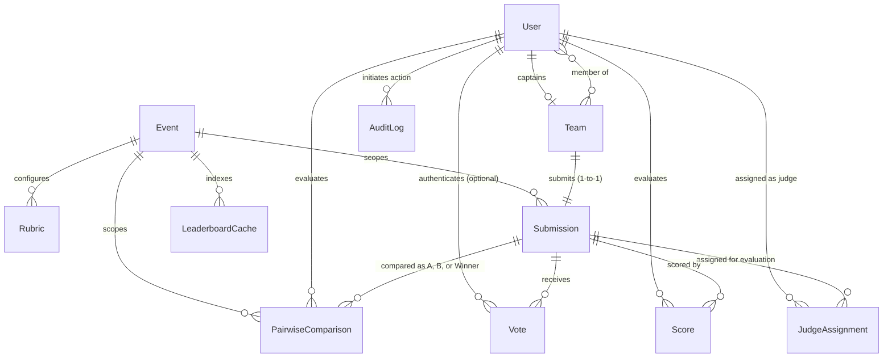

# DogFood 2026 Data Model

## 1. Overview
The DogFood 2026 tournament platform utilizes MongoDB as its primary persistence engine, accessed through Mongoose 8.x Object Data Modeling (ODM) in the Node.js/Express backend. MongoDB collections store stateful domain entities, configuration documents, and audit logs.

The data model organizes hackathon operations across four core functional areas:
1. **Tournament Configuration**: Managed through the `Event` and `Rubric` collections. `Event` defines tournament metadata, competitive tracks, deadlines, and active tournament lifecycle states (`upcoming`, `active`, `judging`, `closed`). `Rubric` defines structured scoring criteria with floating-point weight distributions strictly summing to 1.0.
2. **Participant & Submission Lifecycle**: Captured across `User`, `Team`, and `Submission`. Users affiliate with teams (capped at 4 members) via unique join codes. Teams maintain a 1-to-1 relationship with their project `Submission`, transitioning through `draft`, `submitted`, and `locked` phases.
3. **Judging & Evaluation Pipelines**: Implemented via `JudgeAssignment`, `Score`, `PairwiseComparison`, and `LeaderboardCache`. Judges are assigned project submissions based on track competency and conflict exclusion. Evaluation ballots record raw multi-criteria scores, which feed an asynchronous normalization microservice (`judging-service` running FastAPI) to produce Bayesian-shrunken z-scores and judge calibration metrics stored in `LeaderboardCache`. For head-to-head evaluation, `PairwiseComparison` records feed a Bradley-Terry ranking algorithm.
4. **Community Engagement & Integrity Auditing**: Governed by `Vote` and `AuditLog`. Sybil-resistant public voting employs SHA-256 fingerprint hashing and MongoDB Time-To-Live (TTL) expiration indices. Administrative overrides, score revisions, and role elevations trigger automated, application-level audit entries in `AuditLog`.

---

## 2. Entity Inventory
Every model is defined under [backend/src/models/](file:///c:/Users/Admin/Documents/GitHub/DogFood-Hackathon/backend/src/models/):

| Model Name | Source File | Collection Name | Collection Purpose | Primary References | Key Constraints & Indexes |
| :--- | :--- | :--- | :--- | :--- | :--- |
| **User** | [User.js](file:///c:/Users/Admin/Documents/GitHub/DogFood-Hackathon/backend/src/models/User.js) | `users` | User credentials, roles, team affiliation, judge conflicts | `Team` (`teamId`, `mentoredTeams`) | Unique `email`, indexed `role`, automated audit hooks |
| **Team** | [Team.js](file:///c:/Users/Admin/Documents/GitHub/DogFood-Hackathon/backend/src/models/Team.js) | `teams` | Participant rosters, tracks, and team join credentials | `User` (`captain`, `members`) | Unique `name`, unique 6-char `joinCode`, max 4 members |
| **Submission** | [Submission.js](file:///c:/Users/Admin/Documents/GitHub/DogFood-Hackathon/backend/src/models/Submission.js) | `submissions` | Hackathon projects, repositories, media, and vote counts | `Team` (`team`), `Event` (`event`) | Unique `team` (1-to-1), text search index (`title`, `tagline`, `track`) |
| **JudgeAssignment** | [JudgeAssignment.js](file:///c:/Users/Admin/Documents/GitHub/DogFood-Hackathon/backend/src/models/JudgeAssignment.js) | `judgeassignments` | Routing judges to submissions for isolated evaluation | `User` (`judgeId`), `Submission` (`submissionId`) | Compound unique index `(judgeId, submissionId)` |
| **Score** | [Score.js](file:///c:/Users/Admin/Documents/GitHub/DogFood-Hackathon/backend/src/models/Score.js) | `scores` | Evaluation ballots with criterion scores & raw composite | `User` (`judge`), `Submission` (`submission`) | Compound unique index `(judge, submission)`, audit hooks |
| **Rubric** | [Rubric.js](file:///c:/Users/Admin/Documents/GitHub/DogFood-Hackathon/backend/src/models/Rubric.js) | `rubrics` | Standalone scoring criteria sets and weights per event | `Event` (`eventId`) | Criteria non-empty, sum(weight) == 1.0 (delta $10^{-5}$) |
| **Vote** | [Vote.js](file:///c:/Users/Admin/Documents/GitHub/DogFood-Hackathon/backend/src/models/Vote.js) | `votes` | Sybil-resistant community votes with 24h rolling TTL | `Submission` (`submission`), `User` (`user`) | Compound unique `(submission, voterHash)`, TTL index `votedAt` |
| **AuditLog** | [AuditLog.js](file:///c:/Users/Admin/Documents/GitHub/DogFood-Hackathon/backend/src/models/AuditLog.js) | `auditlogs` | Operational and administrative change records | `User` (`actor`) | Indexed `action`, `targetResource`, `targetId`, `timestamp` |
| **LeaderboardCache** | [LeaderboardCache.js](file:///c:/Users/Admin/Documents/GitHub/DogFood-Hackathon/backend/src/models/LeaderboardCache.js) | `leaderboardcaches` | Normalization outputs, standings, and judge calibrations | None (stores denormalized IDs and strings) | Indexed `eventId`, sortable by `updatedAt` |
| **Event** | [Event.js](file:///c:/Users/Admin/Documents/GitHub/DogFood-Hackathon/backend/src/models/Event.js) | `events` | Global tournament configuration, tracks, deadline, status | Embedded `rubric` subdocuments | Indexed `status`, embedded criteria schema |
| **PairwiseComparison** | [PairwiseComparison.js](file:///c:/Users/Admin/Documents/GitHub/DogFood-Hackathon/backend/src/models/PairwiseComparison.js) | `pairwisecomparisons` | Head-to-head project comparisons for Bradley-Terry ranking | `User` (`judge`), `Submission` (`submissionA`, `submissionB`, `winner`), `Event` (`eventId`) | Non-unique compound index `(judge, submissionA, submissionB)`, distinct-project check |

---

## 3. User
Defined in [backend/src/models/User.js](file:///c:/Users/Admin/Documents/GitHub/DogFood-Hackathon/backend/src/models/User.js).

### 3.1 Schema Fields
```javascript
{
  name: { type: String, required: [true, 'Name is required'], trim: true, alias: 'fullName' },
  email: { type: String, required: [true, 'Email is required'], unique: true, trim: true, lowercase: true, index: true },
  passwordHash: { type: String, required: [true, 'Password hash is required'], select: false },
  role: { type: String, enum: ['participant', 'judge', 'organizer', 'admin'], default: 'participant', index: true },
  trackPreferences: { type: [String], default: [], alias: 'judgeTracks' },
  conflictsOfInterest: { type: [String], default: [] },
  mentoredTeams: { type: [{ type: mongoose.Schema.Types.ObjectId, ref: 'Team' }], default: [] },
  teamId: { type: mongoose.Schema.Types.ObjectId, ref: 'Team', default: null },
  createdAt: { type: Date },
  updatedAt: { type: Date }
}
```

### 3.2 Field Details & Roles
- `role`: Restricted by schema enum to `'participant'`, `'judge'`, `'organizer'`, or `'admin'`. Defaults to `'participant'`.
- `passwordHash`: Configured with `select: false` so Bcrypt hashes are omitted from query projections unless explicitly requested via `.select('+passwordHash')`.
- `teamId`: Direct reference to `Team`. Synchronized when users create or join teams.
- `trackPreferences` (`judgeTracks` alias): Array of track names (e.g., `["AI/ML", "FinTech"]`) used by the judge assignment solver.
- `conflictsOfInterest`: Array of string identifiers representing team IDs or organizations the user cannot objectively evaluate.
- `mentoredTeams`: Array of `Team` ObjectIds representing teams mentored by this user.

### 3.3 Middleware & Audit Hooks
The User schema registers lifecycle hooks to record administrative overrides:
- `post('init')`: Copies document snapshot to `this._original`.
- `pre('save')`: Detects role changes or modifications on existing records, flagging `_shouldAudit = true` and `_auditAction = 'ROLE_ELEVATION'` or `'ADMIN_USER_OVERRIDE'`.
- `post('save')`: Automatically persists an `AuditLog` entry detailing `previousState` and `newState`.
- `pre('findOneAndUpdate')` & `post('findOneAndUpdate')`: Queries original document if role is modified, writing an `AuditLog` entry upon completion.

### 3.4 Assignment and Authorization Usage
- **Authorization**: Middleware ([backend/src/middleware/authMiddleware.js](file:///c:/Users/Admin/Documents/GitHub/DogFood-Hackathon/backend/src/middleware/authMiddleware.js)) verifies JWT claims against `role`. Routes under `/api/v1/admin/*` require `'organizer'` or `'admin'`.
- **Assignment Engine**: [backend/src/services/assignmentSolver.js](file:///c:/Users/Admin/Documents/GitHub/DogFood-Hackathon/backend/src/services/assignmentSolver.js) consumes:
  - `conflictsOfInterest`, `mentoredTeams`, and `teamId` to enforce **Constraint 1 (Conflict Exclusion)**: judges cannot be assigned to evaluate their own team, mentored teams, or declared conflicts.
  - `trackPreferences` to enforce **Constraint 2 (Track Competency)**: cost matrix prioritizes judges with matching track competencies.

---

## 4. Team
Defined in [backend/src/models/Team.js](file:///c:/Users/Admin/Documents/GitHub/DogFood-Hackathon/backend/src/models/Team.js).

### 4.1 Schema Fields
```javascript
{
  name: { type: String, required: [true, 'Team name is required'], unique: true, trim: true, minlength: 3, maxlength: 40 },
  joinCode: {
    type: String,
    required: [true, 'Join code is required'],
    unique: true,
    uppercase: true,
    trim: true,
    minlength: 6,
    maxlength: 6,
    match: [/^[A-Z0-9]{6}$/, 'Join code must be 6 uppercase alphanumeric characters'],
    index: true
  },
  captain: { type: mongoose.Schema.Types.ObjectId, ref: 'User', required: [true, 'Team captain is required'], alias: 'captainId' },
  members: {
    type: [{ type: mongoose.Schema.Types.ObjectId, ref: 'User' }],
    validate: [{ validator: (val) => !val || val.length <= 4, message: 'A team cannot exceed 4 members.' }],
    default: []
  },
  track: { type: String, required: [true, 'Competition track is required'], trim: true, index: true },
  hasSubmitted: { type: Boolean, default: false },
  createdAt: { type: Date },
  updatedAt: { type: Date }
}
```

### 4.2 Relationships & Business Constraints
- **Captain & Members**: `captain` references a `User`. `members` is an array of `User` ObjectIds (typically including the captain).
- **Roster Size Limit**: Enforced doubly at the schema level:
  1. Field-level validator on `members`: `val.length <= 4`.
  2. `pre('save')` hook: rejects save if `this.members.length > 4`.
- **Join Code**: Exactly 6 uppercase alphanumeric characters matching `/^[A-Z0-9]{6}$/`. Unique constraint indexed in MongoDB.
- **Track**: Tracks must align with competition categories (e.g., `AI/ML`, `FinTech`, `HealthTech`, `Web3 & Blockchain`).
- **Submission Link**: `Team` does not store a direct foreign key to `Submission`. Instead, `Submission.team` holds a unique foreign key back to `Team`, enforcing a 1-to-1 relationship. When a submission is finalized, `hasSubmitted` is toggled to `true`.

---

## 5. Submission
Defined in [backend/src/models/Submission.js](file:///c:/Users/Admin/Documents/GitHub/DogFood-Hackathon/backend/src/models/Submission.js).

### 5.1 Schema Fields
```javascript
{
  team: { type: mongoose.Schema.Types.ObjectId, ref: 'Team', required: true, unique: true, index: true, alias: 'teamId' },
  title: { type: String, required: true, trim: true, maxlength: 120 },
  tagline: { type: String, required: true, trim: true, maxlength: 250, alias: 'pitch' },
  event: { type: mongoose.Schema.Types.ObjectId, ref: 'Event' },
  track: { type: String, required: true, index: true, trim: true },
  description: { type: String, required: true, alias: 'descriptionMarkdown' },
  githubUrl: { type: String, required: true, trim: true, alias: 'repoUrl' },
  demoVideoUrl: { type: String, default: '', trim: true, alias: 'demoUrl' },
  thumbnailUrl: { type: String, default: '/uploads/default-thumbnail.webp', trim: true, alias: 'thumbnailPath' },
  status: {
    type: String,
    enum: {
      values: ['draft', 'submitted', 'locked'],
      message: '{VALUE} is not a valid submission status (must be draft, submitted, or locked)'
    },
    default: 'draft',
    index: true
  },
  submittedAt: { type: Date, default: null },
  publicVoteCount: { type: Number, default: 0, index: true },
  createdAt: { type: Date },
  updatedAt: { type: Date }
}
```

### 5.2 Status Values & Lifecycle States
The schema defines three valid states:
1. `'draft'`: Editable by team members via `POST /api/v1/submissions` ([submissionController.upsertSubmission](file:///c:/Users/Admin/Documents/GitHub/DogFood-Hackathon/backend/src/controllers/submissionController.js#L36)).
2. `'submitted'`: Set upon finalization via `POST /api/v1/submissions/finalize`. Locks the document against further participant edits. Sets `submittedAt` and triggers auto-assignment.
3. `'locked'`: Represents administrative or deadline-induced freeze. Controller returns HTTP 423 Locked for updates to `'submitted'` or `'locked'` submissions.

### 5.3 Virtuals, Query Hooks & Indexes
- **Virtual Populate**: Virtual `teamId` maps `team` ObjectId to the `Team` collection.
- **Query Rewriting**: `pre` hook across query methods (`find`, `findOne`, `findOneAndUpdate`, etc.) transparently rewrites queries specifying `{ teamId: ... }` to `{ team: ... }`.
- **Timestamp Hook**: `pre('save')` automatically sets `submittedAt = new Date()` if `status` changes to `'submitted'` and `submittedAt` is null.
- **Indexes**:
  - Unique index: `team: 1`.
  - Single-field indexes: `track: 1`, `status: 1`, `publicVoteCount: 1`.
  - Compound text index: `{ title: 'text', tagline: 'text', track: 'text' }` for gallery search queries.

---

## 6. JudgeAssignment
Defined in [backend/src/models/JudgeAssignment.js](file:///c:/Users/Admin/Documents/GitHub/DogFood-Hackathon/backend/src/models/JudgeAssignment.js).

### 6.1 Schema Fields
```javascript
{
  judgeId: { type: mongoose.Schema.Types.ObjectId, ref: 'User', required: true, index: true, alias: 'judge' },
  submissionId: { type: mongoose.Schema.Types.ObjectId, ref: 'Submission', required: true, index: true, alias: 'submission' },
  track: { type: String, required: true },
  status: {
    type: String,
    enum: ['assigned', 'in_progress', 'completed', 'pending'],
    default: 'assigned',
    index: true
  },
  createdAt: { type: Date },
  updatedAt: { type: Date }
}
```

### 6.2 Compound Index & Uniqueness
- **Unique Constraint**: Compound index `{ judgeId: 1, submissionId: 1 }` with `{ unique: true }`. A judge can never have duplicate assignment records for the same submission.
- **Single-Field Indexes**: `judgeId: 1`, `submissionId: 1`, `status: 1`.

### 6.3 State Transitions & Judging Isolation
- **Status Enum**:
  - `'assigned'`: Initial state when assigned by min-cost max-flow algorithm or manual assignment.
  - `'pending'`: Seed fixture state representing queued evaluations.
  - `'in_progress'`: Set when a judge saves a draft evaluation score (`saveDraftScore`).
  - `'completed'`: Set when a judge submits a final score (`submitScore`).
- **Isolation Enforcement**: [backend/src/middleware/isolationGuard.js](file:///c:/Users/Admin/Documents/GitHub/DogFood-Hackathon/backend/src/middleware/isolationGuard.js) intercepts judging routes. Non-admin judges are forbidden (HTTP 403) from inspecting project details or submitting scores unless an active `JudgeAssignment` exists matching their user ID and the target `submissionId` with `status` in `['assigned', 'in_progress', 'completed']`.

---

## 7. Score
Defined in [backend/src/models/Score.js](file:///c:/Users/Admin/Documents/GitHub/DogFood-Hackathon/backend/src/models/Score.js).

### 7.1 Schema Fields & Subdocument
```javascript
// CriterionScoreSchema (Embedded subdocument, _id: false)
{
  key: { type: String, required: true },
  score: { type: Number, required: true },
  criteriaName: { type: String },
  weight: { type: Number },
  rawScore: { type: Number }
}

// ScoreSchema
{
  judge: { type: mongoose.Schema.Types.ObjectId, ref: 'User', required: true, index: true, alias: 'judgeId' },
  submission: { type: mongoose.Schema.Types.ObjectId, ref: 'Submission', required: true, index: true, alias: 'submissionId' },
  criteriaScores: [CriterionScoreSchema],
  rawCompositeScore: { type: Number, required: true, alias: 'totalRawScore' },
  privateNotes: { type: String, default: '', maxlength: 2000 },
  normalizedScore: { type: Number, default: null },
  zScore: { type: Number, default: null },
  isFinal: { type: Boolean, default: true },
  createdAt: { type: Date },
  updatedAt: { type: Date }
}
```

### 7.2 Score Validation: Schema vs Controller Level
A critical distinction exists between schema constraints and business logic validation:
- **Schema-Level Constraints**:
  - `judge` and `submission` are required ObjectIds.
  - `rawCompositeScore` is a required Number.
  - Subdocument `score` and `key` are required.
  - `privateNotes` has maximum length 2000 characters.
  - Compound unique index: `{ judge: 1, submission: 1 }`.
- **Controller-Level Validation**:
  - The [1.0, 10.0] range and 0.5 step increment are **NOT** Mongoose schema validators.
  - They are enforced in [backend/src/controllers/judgingController.js](file:///c:/Users/Admin/Documents/GitHub/DogFood-Hackathon/backend/src/controllers/judgingController.js#L142-L147) via `isValidScore()`:
    ```javascript
    const isValidScore = (score) => {
      if (typeof score !== 'number' || isNaN(score) || !Number.isFinite(score)) return false;
      if (score < 1.0 || score > 10.0) return false;
      const doubled = Math.round(score * 1000) / 1000 * 2;
      return Math.abs(doubled - Math.round(doubled)) < 1e-6;
    };
    ```

### 7.3 Raw Composite Calculation & Normalization Fields
- **Formula**: `rawCompositeScore = \sum (w_c \times score_c) / \sum w_c`, rounded to 3 decimal places.
- **Draft vs Final**:
  - `isFinal: false` indicates an in-progress draft saved via `POST /api/v1/judging/scores/draft`.
  - `isFinal: true` indicates a submitted ballot via `POST /api/v1/judging/scores`.
- **Normalization Targets**: `normalizedScore` and `zScore` are populated asynchronously after running Bayesian normalization via `adminController.runNormalization()`.
- **Audit Logging**: `post('save')` and `post('findOneAndUpdate')` detect modifications to existing scores and emit `'SCORE_OVERRIDE'` records into `AuditLog`.

---

## 8. Rubric
Defined in [backend/src/models/Rubric.js](file:///c:/Users/Admin/Documents/GitHub/DogFood-Hackathon/backend/src/models/Rubric.js).

### 8.1 Schema Fields & Subdocument
```javascript
// RubricCriterionSchema (_id: false)
{
  key: { type: String, required: [true, 'Criterion key is required'], trim: true },
  label: { type: String, required: [true, 'Criterion label is required'], trim: true },
  description: { type: String, default: '', trim: true },
  weight: { type: Number, required: [true, 'Criterion weight is required'], min: 0, max: 1 },
  minScore: { type: Number, default: 0 },
  maxScore: { type: Number, default: 10 },
  step: { type: Number, default: 1 }
}

// RubricSchema
{
  eventId: { type: mongoose.Schema.Types.ObjectId, ref: 'Event', required: true, index: true },
  criteria: {
    type: [RubricCriterionSchema],
    required: [true, 'Criteria array is required'],
    validate: [
      {
        validator: function (val) {
          if (!val || !Array.isArray(val) || val.length === 0) return false;
          const allHaveWeights = val.every((item) => typeof item?.weight === 'number' && !isNaN(item.weight));
          if (!allHaveWeights) return true;
          const totalWeight = val.reduce((sum, item) => sum + item.weight, 0);
          return Math.abs(totalWeight - 1.0) <= 1e-5;
        },
        message: 'Total criteria weight must sum to 1.0 (within floating point delta 10^-5).'
      }
    ]
  },
  createdAt: { type: Date },
  updatedAt: { type: Date }
}
```

### 8.2 Strict Weight Validation & Floating-Point Tolerance
The schema enforces that `criteria` weights strictly sum to 1.0 using tolerance $\Delta = 10^{-5}$ (`1e-5`). This invariant is enforced in three locations:
1. Mongoose array validator on `criteria`.
2. `pre('validate')` lifecycle hook.
3. `pre('save')` guard hook.

### 8.3 Interaction with Event & Scoring
- **Dual Representation**:
  - The standalone `Rubric` document contains rich criterion definitions (`key`, `label`, `description`, `weight`, `minScore`, `maxScore`, `step`).
  - The `Event` document contains an embedded array `event.rubric` (`name`, `weight`, `scaleMin`, `scaleMax`).
  - [adminController.upsertRubric](file:///c:/Users/Admin/Documents/GitHub/DogFood-Hackathon/backend/src/controllers/adminController.js#L818) updates both simultaneously.
- **Locking**: Guarded by `event.rubricLocked`. If locked, `upsertRubric` returns HTTP 403 Forbidden (`'Rubric is locked against further modification once scoring begins.'`).
- **Scoring Resolution**: `judgingController.resolveRubricWeights()` resolves criterion weights by first querying `Rubric.findOne({ eventId })`. If unconfigured, it falls back to `event.rubric`, and lastly to standard default weights (Technical: 0.30, Innovation: 0.25, Impact: 0.25, Polish: 0.20).

---

## 9. Vote
Defined in [backend/src/models/Vote.js](file:///c:/Users/Admin/Documents/GitHub/DogFood-Hackathon/backend/src/models/Vote.js).

### 9.1 Schema Fields
```javascript
{
  submission: { type: mongoose.Schema.Types.ObjectId, ref: 'Submission', required: true, index: true, alias: 'submissionId' },
  voterHash: { type: String, required: true, index: true, alias: 'fingerprintHash' },
  user: { type: mongoose.Schema.Types.ObjectId, ref: 'User', default: null, alias: 'userId' },
  votedAt: {
    type: Date,
    default: Date.now,
    expires: 86400, // MongoDB TTL index (86,400 seconds = ~24 hours)
    alias: 'createdAt'
  },
  ipAddress: { type: String, select: false }
}
```

### 9.2 TTL Index & Deduplication Semantics
The TTL behavior has precise characteristics that must be distinguished from application-level guarantees:
1. **Approximate Expiration**: `votedAt` has `{ expires: 86400 }`. MongoDB deletes expired documents via a background TTL monitor thread that runs periodically (typically once every 60 seconds). Deletion is therefore **approximate** (~24 hours after `votedAt`) and is **NOT** an exact wall-clock deletion event.
2. **Deduplication Window**: The compound unique index `{ submission: 1, voterHash: 1 }` prevents the same fingerprint from voting on a submission while the `Vote` document exists in the collection.
3. **Rolling Re-voting**: Once the background TTL monitor removes the expired document, the unique constraint no longer blocks that `(submission, voterHash)` combination, allowing a new vote to be recorded.
4. **Counter Decoupling**: **Crucially, MongoDB TTL deletion does NOT automatically decrement `Submission.publicVoteCount`**. `publicVoteCount` is an incremented counter on the `Submission` document. It is only decremented if a voter explicitly revokes their vote via `DELETE /api/v1/votes/:submissionId` while their `Vote` record is active. Expired TTL votes leave the historical counter on `Submission` intact.

### 9.3 Fingerprint Generation & Anomaly Detection
- **Hash Derivation**: Static method `Vote.generateVoterHash(clientIp, userAgent, secretSalt)` computes `SHA-256(clientIp + userAgent + secretSalt)`.
- **IP Handling**: Stored in `ipAddress` with `select: false` to ensure client IP addresses are not exposed in query projections.
- **Velocity Spike Detection**: `voteController.castVote()` inspects recent votes for the target submission. If $\ge 10$ votes occur within 60 seconds, an audit record (`action: 'VOTE_ANOMALY_DETECTED'`) is emitted into `AuditLog`.

---

## 10. AuditLog
Defined in [backend/src/models/AuditLog.js](file:///c:/Users/Admin/Documents/GitHub/DogFood-Hackathon/backend/src/models/AuditLog.js).

### 10.1 Schema Fields
```javascript
{
  actor: { type: mongoose.Schema.Types.ObjectId, ref: 'User', index: true, alias: 'actorId' },
  actorRole: { type: String, default: 'system' },
  action: { type: String, required: true, index: true },
  targetResource: { type: String, required: true, index: true },
  targetId: { type: mongoose.Schema.Types.ObjectId, index: true, alias: 'resourceId' },
  previousState: { type: mongoose.Schema.Types.Mixed, default: {} },
  newState: { type: mongoose.Schema.Types.Mixed, default: {} },
  payload: { type: mongoose.Schema.Types.Mixed },
  ipAddress: { type: String, alias: 'ipHash' },
  timestamp: { type: Date, default: Date.now, index: true }
}
```

### 10.2 Architectural Distinction: Tamper-Evident vs Immutable Storage
> [!IMPORTANT]
> The `AuditLog` collection implements an **application-level, tamper-evident audit trail**.
> It is **NOT** a cryptographically immutable, append-only ledger.
> - **Actual Implementation**: Application code and Mongoose middleware hooks automatically write audit records detailing state transitions (e.g., `ROLE_ELEVATION`, `SCORE_OVERRIDE`, `RUBRIC_LOCKED`, `SUBMISSION_LOCKED`, `NORMALIZATION_EXECUTED`).
> - **Limitations**: It does not use cryptographic hash-chaining, Merkle trees, block headers, or WORM (Write Once Read Many) hardware storage. A database administrator with direct MongoDB credentials could alter or delete documents.

### 10.3 Pre-Save Synchronization
The schema includes `pre('validate')` and `pre('save')` hooks ensuring bidirectional synchronization between `payload` and `{ previousState, newState }`: if `payload` is omitted but previous/new states exist, `payload` is synthesized automatically.

---

## 11. LeaderboardCache
Defined in [backend/src/models/LeaderboardCache.js](file:///c:/Users/Admin/Documents/GitHub/DogFood-Hackathon/backend/src/models/LeaderboardCache.js).

### 11.1 Schema Fields & Subdocuments
```javascript
// StandingEntrySchema (_id: false, strict: false)
{
  submissionId: { type: mongoose.Schema.Types.Mixed, alias: 'submission_id' },
  rank: { type: Number, required: true },
  normalizedScore: { type: Number, required: true, alias: 'normalized_score' },
  rawMean: { type: Number, alias: 'raw_mean' },
  zScore: { type: Number, alias: 'z_mean' },
  zScoreMean: { type: Number, alias: 'z_score_mean' },
  ballotCount: { type: Number, alias: 'ballot_count' },
  teamName: { type: String },
  title: { type: String },
  track: { type: String }
}

// JudgeCalibrationSchema (_id: false, strict: false)
{
  judgeId: { type: mongoose.Schema.Types.Mixed, alias: 'judge_id' },
  sampleSize: { type: Number, alias: 'sample_size' },
  rawMean: { type: Number, alias: 'raw_mean' },
  rawStd: { type: Number, alias: 'raw_std' },
  bias: { type: Number }
}

// LeaderboardCacheSchema (strict: false, timestamps: true)
{
  eventId: { type: String, default: 'default-event', index: true },
  standings: [StandingEntrySchema],
  judgeCalibrations: [JudgeCalibrationSchema],
  submissionId: { type: mongoose.Schema.Types.Mixed, alias: 'submission_id' },
  rank: { type: Number },
  normalizedScore: { type: Number, alias: 'normalized_score' },
  rawMean: { type: Number, alias: 'raw_mean' },
  zScore: { type: Number, alias: 'z_score' },
  ballotCount: { type: Number, alias: 'ballot_count' },
  algorithm: { type: String, default: 'z_score_bayesian_shrinkage' },
  totalSubmissions: { type: Number, default: 0, alias: 'total_submissions' },
  totalScoresProcessed: { type: Number, default: 0, alias: 'total_scores_processed' },
  isFallback: { type: Boolean, default: false, alias: 'is_fallback' },
  cachedAt: { type: Date, default: Date.now }
}
```

### 11.2 Persistence & Consumption Lifecycle
1. **Creation**: Written by `adminController.runNormalization()` / `normalizeScores()` after receiving normalized responses from FastAPI.
2. **Fallback Marker**: When FastAPI is unavailable, `isFallback` is set to `true`, and `algorithm` is set to `'raw_weighted_average_fallback'`.
3. **Consumption**: Queried via `LeaderboardCache.getLatest(eventId)` by:
   - `adminController.getLeaderboard`: provides administrative standings.
   - `adminController.exportLeaderboardCsv` & `exportLeaderboardJson`: supplies data for final exports.
   - `submissionController.getPublicLeaderboard`: displays public tournament results.

---

## 12. Event
Defined in [backend/src/models/Event.js](file:///c:/Users/Admin/Documents/GitHub/DogFood-Hackathon/backend/src/models/Event.js).

### 12.1 Schema Fields & Embedded Subdocument
```javascript
// RubricCriterionSchema (_id: false)
{
  name: { type: String, required: true },
  weight: { type: Number, required: true, min: 0, max: 1 },
  scaleMin: { type: Number, default: 1 },
  scaleMax: { type: Number, default: 10 }
}

// EventSchema
{
  title: { type: String, required: [true, 'Event title is required'], trim: true, alias: 'name' },
  description: { type: String, default: '', trim: true },
  tracks: { type: [String], default: [] },
  status: {
    type: String,
    enum: {
      values: ['upcoming', 'active', 'judging', 'closed'],
      message: '{VALUE} is not a valid event status'
    },
    default: 'active',
    index: true
  },
  submissionDeadline: { type: Date, required: [true, 'Submission deadline is required'] },
  rubricLocked: { type: Boolean, default: false },
  rubric: { type: [RubricCriterionSchema], default: [] },
  createdAt: { type: Date },
  updatedAt: { type: Date }
}
```

### 12.2 Components Relying on Active Event
The active event (where `status: 'active'`) governs operational behavior across the platform:
- **Submission Finalization**: `submissionController.finalizeSubmission()` checks `event.submissionDeadline`. If `new Date() > deadline`, submissions are rejected with HTTP 423 Locked.
- **Rubric Configuration**: `adminController.upsertRubric()` verifies `event.rubricLocked`. If true, modifications are blocked.
- **Scoring Pipeline**: `judgingController.resolveRubricWeights()` pulls rubric definitions using the active `event._id`.
- **Normalization Engine**: `adminController.runNormalization()` scopes completed scores to submissions belonging to the active event.

---

## 13. PairwiseComparison
Defined in [backend/src/models/PairwiseComparison.js](file:///c:/Users/Admin/Documents/GitHub/DogFood-Hackathon/backend/src/models/PairwiseComparison.js).

### 13.1 Schema Fields
```javascript
{
  judge: { type: mongoose.Schema.Types.ObjectId, ref: 'User', required: true, index: true, alias: 'judgeId' },
  submissionA: { type: mongoose.Schema.Types.ObjectId, ref: 'Submission', required: true, index: true, alias: 'submission_a' },
  submissionB: {
    type: mongoose.Schema.Types.ObjectId,
    ref: 'Submission',
    required: true,
    index: true,
    alias: 'submission_b',
    validate: {
      validator: function (v) {
        const subA = this.submissionA || this.submission_a;
        if (!subA || !v) return true;
        return subA.toString() !== v.toString();
      },
      message: 'submissionA and submissionB must be distinct submissions.'
    }
  },
  winner: {
    type: mongoose.Schema.Types.ObjectId,
    ref: 'Submission',
    required: true,
    index: true,
    validate: {
      validator: function (v) {
        const subA = this.submissionA || this.submission_a;
        const subB = this.submissionB || this.submission_b;
        if (!v || !subA || !subB) return true;
        const vStr = v.toString();
        return vStr === subA.toString() || vStr === subB.toString();
      },
      message: 'Winner must be either submissionA or submissionB.'
    }
  },
  notes: { type: String, default: '', maxlength: 2000 },
  eventId: { type: mongoose.Schema.Types.ObjectId, ref: 'Event', default: null, index: true },
  createdAt: { type: Date },
  updatedAt: { type: Date }
}
```

### 13.2 Index Properties & Non-Uniqueness
- **Compound Index**: `{ judge: 1, submissionA: 1, submissionB: 1 }` is **NON-UNIQUE** in the schema.
- Unlike `Score` or `JudgeAssignment`, judges may submit multiple comparison records for the same pair (e.g., across separate evaluation rounds or iterative reviews).
- Single-field indexes exist on `judge`, `submissionA`, `submissionB`, `winner`, and `eventId`.

### 13.3 Connected-Graph Requirement in Bradley-Terry Ranking
The head-to-head comparison records feed the Bradley-Terry solver in [judging-service/app/algorithms/pairwise.py](file:///c:/Users/Admin/Documents/GitHub/DogFood-Hackathon/judging-service/app/algorithms/pairwise.py).
In `pairwise.py` (lines 63-76), `_validate_and_index()` verifies that the undirected graph formed by comparison edges is fully connected:
```python
if len(ids) > 1:
    visited = {ids[0]}
    while True:
        newly_reached = {
            project_id
            for edge in edges
            for project_id in edge
            if edge[0] in visited or edge[1] in visited
        } - visited
        if not newly_reached:
            break
        visited.update(newly_reached)
    if len(visited) != len(ids):
        raise ValueError("comparison graph must be connected")
```
If any submission or group of submissions is isolated without direct or indirect comparison paths to the rest of the pool, the Bradley-Terry algorithm raises `ValueError("comparison graph must be connected")`.

---

## 14. Entity Relationships
The following Mermaid diagram depicts all actual foreign-key references, subdocuments, and virtual links verified across the Mongoose schemas:



---

## 15. Indexes and Constraints

| Collection | Target Fields | Index Type | Schema Constraint | Enforcing Layer | Rationale / Application Behavior |
| :--- | :--- | :--- | :--- | :--- | :--- |
| **users** | `email` | B-tree Unique | Unique, lowercase, trim | MongoDB & Schema | Primary user authentication identity |
| **users** | `role` | B-tree | Enum: participant, judge, organizer, admin | MongoDB & Schema | Fast lookup for RBAC authorization checks |
| **teams** | `name` | B-tree Unique | Unique, min 3, max 40 | MongoDB & Schema | Unique public team identification |
| **teams** | `joinCode` | B-tree Unique | Unique, uppercase, regex `^[A-Z0-9]{6}$` | MongoDB & Schema | Roster join authentication |
| **teams** | `track` | B-tree | Required String | MongoDB | Track-based team grouping |
| **teams** | `members` | N/A | Max 4 items | Mongoose & Pre-Save Hook | Maximum team roster constraint |
| **submissions** | `team` | B-tree Unique | Unique, required ObjectId | MongoDB & Schema | Enforces strict 1-to-1 Team-to-Submission mapping |
| **submissions** | `track` | B-tree | Required String | MongoDB | Track-based gallery filtering |
| **submissions** | `status` | B-tree | Enum: draft, submitted, locked | MongoDB & Schema | Lifecycle state queries |
| **submissions** | `publicVoteCount` | B-tree | Number | MongoDB | Leaderboard and public gallery sorting |
| **submissions** | `title`, `tagline`, `track` | Text Index | Compound text | MongoDB | Full-text keyword search in public gallery |
| **judgeassignments** | `judgeId`, `submissionId` | B-tree Unique | Compound Unique | MongoDB & Schema | Prevents duplicate judge assignments to a project |
| **judgeassignments** | `judgeId` | B-tree | Required ObjectId | MongoDB | Fetching judge-specific evaluation queues |
| **judgeassignments** | `submissionId` | B-tree | Required ObjectId | MongoDB | Checking project assignment counts |
| **judgeassignments** | `status` | B-tree | Enum: assigned, in_progress, completed, pending | MongoDB & Schema | Filtering active vs completed evaluations |
| **scores** | `judge`, `submission` | B-tree Unique | Compound Unique | MongoDB & Schema | Enforces exactly one score ballot per judge/project |
| **scores** | `judge` | B-tree | Required ObjectId | MongoDB | Querying ballots by judge |
| **scores** | `submission` | B-tree | Required ObjectId | MongoDB | Aggregating ballots for project normalization |
| **scores** | `criteriaScores.score` | N/A | Range [1.0, 10.0], step 0.5 | **Controller Layer** (`isValidScore`) | Multi-criteria scoring increment validation |
| **rubrics** | `eventId` | B-tree | Required ObjectId | MongoDB | Fetching active rubric by event |
| **rubrics** | `criteria` | N/A | Non-empty, sum(weight) == 1.0 ($\pm 10^{-5}$) | Mongoose & Pre-Save Hook | Mathematical integrity of weighted composite scoring |
| **votes** | `submission`, `voterHash` | B-tree Unique | Compound Unique | MongoDB & Schema | Sybil prevention: one vote per fingerprint/submission per TTL |
| **votes** | `votedAt` | TTL Index | `expireAfterSeconds: 86400` | MongoDB Background Monitor | Rolling ~24h expiration of vote deduplication records |
| **votes** | `submission` | B-tree | Required ObjectId | MongoDB | Counting votes per project |
| **votes** | `voterHash` | B-tree | Required String | MongoDB | Querying voter history |
| **auditlogs** | `actor` | B-tree | ObjectId | MongoDB | Filter logs by administrative actor |
| **auditlogs** | `action` | B-tree | Required String | MongoDB | Filter logs by operation type |
| **auditlogs** | `targetResource` | B-tree | Required String | MongoDB | Filter logs by modified entity type |
| **auditlogs** | `targetId` | B-tree | ObjectId | MongoDB | Trace lifecycle of a specific document |
| **auditlogs** | `timestamp` | B-tree | Date | MongoDB | Chronological audit trail inspection |
| **leaderboardcaches**| `eventId` | B-tree | String | MongoDB | Fetching latest cached standings by event |
| **events** | `status` | B-tree | Enum: upcoming, active, judging, closed | MongoDB & Schema | Identifying active tournament instance |
| **pairwisecomparisons** | `judge`, `submissionA`, `submissionB` | B-tree | **NON-UNIQUE** Compound | MongoDB | Querying comparison pairs evaluated by a judge |
| **pairwisecomparisons** | `judge` | B-tree | Required ObjectId | MongoDB | Filtering comparisons by judge |
| **pairwisecomparisons** | `submissionA`, `submissionB` | B-tree | Distinct ObjectIds required | MongoDB & Mongoose Validator | Disallows self-comparisons ($A \ne B$) |
| **pairwisecomparisons** | `winner` | B-tree | Must match `submissionA` or `submissionB` | MongoDB & Mongoose Validator | Winner must belong to the compared pair |
| **pairwisecomparisons** | `eventId` | B-tree | ObjectId | MongoDB | Scoping comparisons to event |

---

## 16. Data Lifecycle

### 16.1 User Lifecycle
- **Creation**: Generated via `POST /api/v1/auth/register` in `authController.js` or via seed scripts. Bcrypt hashes password; role defaults to `'participant'`.
- **Update**: Profile updates via `authController.updateProfile`. Role changes and administrative overrides via `adminController.updateUserRole` or `adminController.overrideUser` trigger Mongoose `save`/`findOneAndUpdate` hooks that write `ROLE_ELEVATION` or `ADMIN_USER_OVERRIDE` records to `AuditLog`.
- **Deletion**: Managed administratively; removes user reference from `Team.members`.

### 16.2 Team Lifecycle
- **Creation**: Created via `POST /api/v1/teams` in `teamController.js`. Assigns creator as `captain`, generates a unique 6-character `joinCode`.
- **Roster Modification**: Members join via `POST /api/v1/teams/join` using `joinCode`. Schema validates `members.length <= 4`. User's `teamId` is updated.
- **Submission Binding**: When the team submits a project, `hasSubmitted` is toggled to `true`.

### 16.3 Submission Lifecycle
- **Drafting**: Created via `POST /api/v1/submissions` in `submissionController.js` with `status: 'draft'`. Team members can update metadata, repository links, descriptions, and media.
- **Finalization & Lock**: Finalized via `POST /api/v1/submissions/finalize` or `POST /api/v1/submissions/:id/finalize`. Checks `event.submissionDeadline`; if open, sets `status: 'submitted'` and `submittedAt: new Date()`. Emits `SUBMISSION_LOCKED` to `AuditLog`. Toggles `team.hasSubmitted = true`. Triggers `assignmentSolver.autoAssignSubmission()`. Subsequent updates are rejected with HTTP 423 Locked.

### 16.4 JudgeAssignment Lifecycle
- **Generation**: Created automatically upon submission finalization via `assignmentSolver.autoAssignSubmission()` or batch-generated by administrators via `adminController.autoAssignJudges()`. Initial status is `'assigned'` (or `'pending'` in fixtures).
- **Progress**: Toggled to `'in_progress'` when a judge saves a draft score (`saveDraftScore`).
- **Completion**: Toggled to `'completed'` when a judge submits a final score (`submitScore`).

### 16.5 Score Lifecycle
- **Drafting**: Created or updated via `POST /api/v1/judging/scores/draft` in `judgingController.js` (`isFinal: false`).
- **Final Submission**: Created or updated via `POST /api/v1/judging/scores` (`isFinal: true`). Validates 1.0–10.0 score bounds and 0.5 increments. Computes `rawCompositeScore`. Marks `JudgeAssignment` as `'completed'`. Emits `SCORE_SUBMITTED` to `AuditLog`.
- **Administrative Override**: Modified via `adminController.overrideScore()`. Updates raw score, emits `SCORE_OVERRIDE` to `AuditLog`.
- **Normalization Backfill**: `normalizedScore` and `zScore` are populated during leaderboard normalization via `Score.updateMany()`.

### 16.6 Vote Lifecycle
- **Casting**: Created via `POST /api/v1/votes/:submissionId` in `voteController.js`. Calculates SHA-256 fingerprint hash. Enforces compound unique index. Increments `Submission.publicVoteCount`.
- **Revocation**: Removed via `DELETE /api/v1/votes/:submissionId` while the record is active. Decrements `Submission.publicVoteCount`.
- **TTL Eviction**: Approximately 24 hours after creation, MongoDB's background TTL thread evicts the document. **Note**: This resets the voter's ability to vote again but does **not** decrement `Submission.publicVoteCount`.

### 16.7 AuditLog Lifecycle
- **Creation**: Emitted continuously by Mongoose middleware (`User`, `Score`) and explicit controller calls (`adminController`, `submissionController`, `voteController`).
- **Immutability**: Read-only via `adminController.getAuditLogs()`. No updates or application-level deletions are permitted.

### 16.8 LeaderboardCache Lifecycle
- **Generation**: Produced whenever `adminController.runNormalization()` / `normalizeScores()` runs. Overwrites or creates the cache entry for `eventId`.
- **Consumption**: Read by leaderboard display and CSV/JSON export routes.

---

## 17. Judging Data Flow
The scoring and normalization pipeline processes ballots from raw input to final ranked standings:

```
[Judge Ballot Submission]
        │
        ▼
Score Record Saved
  - criteriaScores: [{ key, score, weight }]
  - rawCompositeScore: \sum(w_c * score_c)
  - isFinal: true
        │
        ▼
adminController.runNormalization() / normalizeScores()
  - Queries all completed scores: Score.find({ isFinal: { $ne: false } })
  - Scopes to active Event submissions
        │
        ▼
fastApiClient.normalizeScores(eventId, scores)
  - Transforms scores into FastAPI payload: [{ judge_id, submission_id, raw_composite_score }]
  - Clamps raw scores into [1.0, 10.0]
        │
        ├─────────────────────────────────────────────────┐
        ▼ (Standard Path: FastAPI Available)              ▼ (Degraded Fallback Path: FastAPI Down)
FastAPI Normalization Service                     computeFallbackStandings()
  - Route: POST /api/v1/normalize                   - Status: 'fallback'
  - Algorithm: z_score_bayesian_shrinkage           - Algorithm: 'raw_weighted_average_fallback'
  - Computes judge means, std deviations, bias      - Groups by submission, calculates raw mean
  - Computes submission zScoreMean & normalizedScore - Ranks descending by raw average
        │                                                 │
        └────────────────────────┬────────────────────────┘
                                 │
                                 ▼
LeaderboardCache.findOneAndUpdate()
  - Upserts cache record for eventId
  - Persists standings: [{ submissionId, rank, normalizedScore, rawMean, zScore, ballotCount }]
  - Persists judgeCalibrations: [{ judgeId, sampleSize, rawMean, rawStd, bias }]
  - Flags isFallback: true / false
                                 │
                                 ▼
Score Document Backfill
  - Executes Score.updateMany() per submission:
    Score.updateMany(
      { $or: [{ submission: subId }, { submissionId: subId }] },
      { normalizedScore, zScore }
    )
                                 │
                                 ▼
Public Leaderboard & Export Consumption
  - GET /api/v1/leaderboard
  - GET /api/v1/admin/export/csv
  - GET /api/v1/admin/export/json
```

---

## 18. Seed Data
Initial tournament fixtures are populated via [seed/init-mongo.js](file:///c:/Users/Admin/Documents/GitHub/DogFood-Hackathon/seed/init-mongo.js) targeting the `dogfood` database:

### 18.1 Seeded Entities
1. **Event**:
   - `title` / `name`: `"Hackathon Raptors 2026"`
   - `status`: `"active"`
   - `submissionDeadline`: Boot time + 24 hours
   - `tracks`: `["AI/ML", "Web3 & Blockchain", "FinTech", "HealthTech"]`
   - `rubric`: 4 criteria embedded in Event:
     - Technical Execution (30%, scale 1–10)
     - Innovation & Originality (25%, scale 1–10)
     - Practical Impact (25%, scale 1–10)
     - Polish & Presentation (20%, scale 1–10)
2. **Default Accounts** (11 Users, default password `Raptor2026!`, Bcrypt hash `$2a$10$LisA82BEO4zOdIb2ym0Y6O7XHXT9lrgIDV4f.ZUIvgrZFBSr5lo8K`):
   - **Organizer** (1): `organizer@dogfood.local` (`role: "organizer"`).
   - **Judges** (4):
     - `judge.ai@dogfood.local` (Track: `AI/ML`)
     - `judge.web3@dogfood.local` (Track: `Web3 & Blockchain`)
     - `judge.fintech@dogfood.local` (Track: `FinTech`)
     - `judge.health@dogfood.local` (Track: `HealthTech`)
   - **Participants** (6):
     - `alex@dogfood.local`, `sarah@dogfood.local`, `david@dogfood.local` (Team 1)
     - `maria@dogfood.local`, `james@dogfood.local`, `priya@dogfood.local` (Team 2)
3. **Teams** (2):
   - `CyberDinos`: `joinCode: "RAPTOR"`, captain Alex Rivera, track `AI/ML`, `hasSubmitted: true`.
   - `BioPulse`: `joinCode: "PULSE1"`, captain Maria Garcia, track `HealthTech`, `hasSubmitted: true`.
4. **Submissions** (2):
   - `"Neural Raptor"` (Team: CyberDinos, Track: `AI/ML`, `status: "submitted"`, `publicVoteCount: 12`).
   - `"HealthSync Pulse"` (Team: BioPulse, Track: `HealthTech`, `status: "submitted"`, `publicVoteCount: 8`).
   - Text search index created on `{ title: "text", tagline: "text", track: "text" }`.
5. **JudgeAssignments** (2):
   - `judge.ai` assigned to `"Neural Raptor"` (`status: "pending"`).
   - `judge.health` assigned to `"HealthSync Pulse"` (`status: "pending"`).

### 18.2 Unseeded Collections
The seed script initializes no records for `scores`, `votes`, `auditlogs`, `leaderboardcaches`, `rubrics` (standalone collection), or `pairwisecomparisons`. These collections populate dynamically during hackathon operation.

---

## 19. Known Data-Model Limitations
1. **Standalone MongoDB Deployment**: The platform operates against a single MongoDB container (`mongo:7.0`) without a replica set. Consequently, multi-document ACID transactions (`session.withTransaction()`) are not supported; operations rely on document-level atomicity.
2. **Decoupled Vote TTL & Public Vote Count**: MongoDB's background TTL thread periodically cleans up expired `Vote` documents after ~24 hours, resetting the voter fingerprint deduplication window. However, this does **not** decrement `Submission.publicVoteCount`. The counter reflects cumulative historical upvotes unless explicitly revoked while the vote document exists.
3. **Approximate TTL Eviction**: Because MongoDB's TTL cleanup thread runs once every 60 seconds, vote record deletion is approximate and cannot guarantee exact-to-the-second expiration.
4. **Dual Rubric Representations**: Rubric criteria are modeled both as subdocuments on `Event.rubric` and as an independent collection in `Rubric`. While `adminController.upsertRubric` synchronizes both, inconsistent manual updates to MongoDB could produce divergence.
5. **Application-Level Audit Trail**: `AuditLog` records are inserted as standard MongoDB documents. They do not employ cryptographic hashing or append-only filesystem locks, making them vulnerable to direct database tampering if administrative database access is compromised.
6. **Denormalized Leaderboard Cache**: `LeaderboardCache` stores denormalized arrays of standings and calibrations. If submissions or scores are updated without triggering normalization, cached standings will diverge from live score documents until `runNormalization()` is re-executed.

---

## 20. Source-of-Truth Rules
To eliminate ambiguity when developing or evaluating the DogFood platform, the following source-of-truth rules apply:
1. **Mongoose Models ([backend/src/models/*.js](file:///c:/Users/Admin/Documents/GitHub/DogFood-Hackathon/backend/src/models/)) are authoritative** for all field names, data types, schema-level validations, default values, subdocuments, and database indexes.
2. **Controllers & Middleware ([backend/src/controllers/](file:///c:/Users/Admin/Documents/GitHub/DogFood-Hackathon/backend/src/controllers/) and [backend/src/middleware/](file:///c:/Users/Admin/Documents/GitHub/DogFood-Hackathon/backend/src/middleware/)) are authoritative** for business logic, numerical scoring ranges ([1.0, 10.0] with step 0.5), judging isolation rules, and lifecycle state machines.
3. **Algorithm Implementations ([judging-service/app/algorithms/](file:///c:/Users/Admin/Documents/GitHub/DogFood-Hackathon/judging-service/app/algorithms/)) are authoritative** for mathematical guarantees, such as the connected-graph requirement for Bradley-Terry pairwise ranking and Bayesian shrinkage formulas.
4. **Seed Fixtures ([seed/init-mongo.js](file:///c:/Users/Admin/Documents/GitHub/DogFood-Hackathon/seed/init-mongo.js)) are authoritative** for initial tournament boot state, seeded accounts, default passwords, and initial assignments.
5. **No markdown documentation or README overrides the code**: If a documentation file mentions an index or constraint not present in `backend/src/models/` or its controllers, the implementation in the codebase is the definitive truth.
