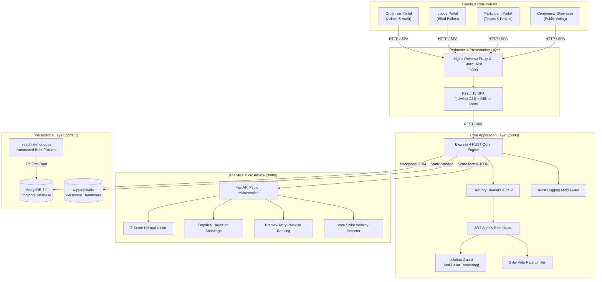

# Dogfood 2026 — Self-Hosted Air-Gapped Hackathon Platform

> **Hackathon Raptors 2026** — Engineered by Somnath, Falguni, and Om Apar.  
> An offline-first, enterprise-grade hackathon management, submission, judging, and community platform featuring statistical score normalization (Z-score + Empirical Bayesian shrinkage), cryptographic isolation guards, and single-command deployment.

---

## ⚡ Single-Command Quickstart

The entire platform runs in an isolated, air-gapped Docker network with a single command from the repository root:

```bash
docker compose up --build
```

### 🌐 Service Port Matrix

| Service | Protocol | Host URL | Description |
|---|---|---|---|
| **Frontend Web Portal** | HTTP | [http://localhost:3000](http://localhost:3000) | React 18 SPA served via Nginx with offline vendored typography |
| **Backend REST API** | HTTP | [http://localhost:5000/api/v1](http://localhost:5000/api/v1) | Node.js 20 & Express Core API with cryptographic role isolation |
| **Judging Microservice** | HTTP | [http://localhost:8000](http://localhost:8000) | Python 3.11 & FastAPI statistical analytics service |
| **MongoDB Database** | TCP | `mongodb://localhost:27017/dogfood` | MongoDB 7.0 database engine with automatic seed fixtures |

### 🩺 Healthcheck Endpoints
- **Core API Health:** [http://localhost:5000/api/v1/health](http://localhost:5000/api/v1/health)
- **Judging Service Health:** [http://localhost:8000/health](http://localhost:8000/health)

---

## 🔄 Automated Seed Initialization & Scratch DB Reset

The database automatically initializes upon cold start from [`seed/init-mongo.js`](seed/init-mongo.js) via Docker's `/docker-entrypoint-initdb.d/` hook.

### Instantaneous Reset & Seed Verification

To reset scratch databases and verify fixture generation locally without Docker:

```powershell
# 1. Clean scratch databases
mongosh dogfood --eval "db.dropDatabase()"

# 2. Instantaneous seed execution (< 1 second)
mongosh seed/init-mongo.js
```

### Local Bare-Metal Development (Alternative to Docker)

If running services directly on host:

```bash
# Terminal 1: Seed MongoDB
mongosh seed/init-mongo.js

# Terminal 2: Judging Analytics Microservice
cd judging-service
pip install -r requirements.txt
python -m uvicorn app.main:app --port 8000 --reload

# Terminal 3: Backend REST Core
cd backend
npm install
npm run dev

# Terminal 4: Frontend SPA
cd frontend
npm install
npm run dev
```

---

## 🔑 Pre-Seeded Default Accounts

All pre-seeded fixtures share the tournament master password:  
👉 **`Raptor2026!`**

| Role | Account Name | Email | Focus / Permissions |
|---|---|---|---|
| **Organizer** | Tournament Organizer | `organizer@dogfood.local` | Platform Admin, Rubric Configuration & Locking, Judge Assignment, Score Normalization, CSV/JSON Export, Audit Logs |
| **Judge (AI/ML)** | Dr. Elena Rostova | `judge.ai@dogfood.local` | Scoring & evaluating AI/ML track submissions |
| **Judge (Web3)** | Satoshi Vance | `judge.web3@dogfood.local` | Scoring & evaluating Web3 & Blockchain track submissions |
| **Judge (FinTech)** | Marcus Sterling | `judge.fintech@dogfood.local` | Scoring & evaluating FinTech track submissions |
| **Judge (HealthTech)** | Dr. Clara Chen | `judge.health@dogfood.local` | Scoring & evaluating HealthTech track submissions |
| **Participant** | Alex Rivera (Captain) | `alex@dogfood.local` | Team Captain of **CyberDinos** (AI/ML track, Join Code: `RAPTOR`) |
| **Participant** | Sarah Connor | `sarah@dogfood.local` | Member of **CyberDinos** |
| **Participant** | David Kim | `david@dogfood.local` | Member of **CyberDinos** |
| **Participant** | Maria Garcia (Captain) | `maria@dogfood.local` | Team Captain of **BioPulse** (HealthTech track, Join Code: `PULSE1`) |
| **Participant** | James Wilson | `james@dogfood.local` | Member of **BioPulse** |
| **Participant** | Priya Patel | `priya@dogfood.local` | Member of **BioPulse** |

### Pre-Configured Seed Fixtures
- **Event:** `Hackathon Raptors 2026` (Active, 4 Rubric Criteria: Technical Execution [30%], Innovation & Originality [25%], Practical Impact [25%], Polish & Presentation [20%]).
- **Projects:** 
  - `Neural Raptor` (Track: AI/ML, Team: CyberDinos, 12 community votes).
  - `HealthSync Pulse` (Track: HealthTech, Team: BioPulse, 8 community votes).
- **Assigned Queues:** Active judge assignments for AI/ML and HealthTech submissions.

---

## 🏛️ System Architecture



### 📂 Repository File Structure

```text
DogFood Hackathon Main/
├── docker-compose.yml          # Multi-container orchestration (172.28.0.0/16 isolated network)
├── .env.example                # Canonical environment template
├── .dogfood.toml               # Benchmark & specification descriptor
├── README.md                   # System documentation & operations guide
├── acceptance-report.txt       # Automated verification report
│
├── seed/                       # Fixture Generation
│   └── init-mongo.js           # Instantaneous idempotent seed script
│
├── backend/                    # Node.js 20 & Express REST Core
│   ├── src/
│   │   ├── config/             # DB, JWT, and Multer disk storage config
│   │   ├── controllers/        # Auth, Team, Submission, Judging, Admin, Vote
│   │   ├── middleware/         # roleGuard, isolationGuard, rateLimiter, errorHandlers
│   │   ├── models/             # Mongoose schemas (User, Team, Submission, Score, AuditLog, etc.)
│   │   ├── routes/             # REST route endpoints (/auth, /teams, /submissions, etc.)
│   │   ├── services/           # Judge assignment solver, FastAPI client, CSV/JSON exporter
│   │   └── index.js            # Express application bootstrap & security policy
│   ├── tests/                  # 22 test suites, 292 passing unit & integration tests
│   └── Dockerfile              # Production Node.js Alpine container
│
├── judging-service/            # Python 3.11 & FastAPI Analytics Microservice
│   ├── app/
│   │   ├── algorithms/         # Z-Score, Bayesian shrinkage, Bradley-Terry, Anomaly detection
│   │   ├── models/             # Pydantic validation schemas
│   │   ├── routes/             # /api/v1/normalize, /health, /pairwise-rank
│   │   └── main.py             # FastAPI entrypoint
│   ├── tests/                  # 74 passing unit & algorithmic tests
│   └── Dockerfile              # Slim Python ASGI container
│
└── frontend/                   # React 18 SPA (Vite + Tailwind CSS)
    ├── src/
    │   ├── components/         # Navbar, RubricSlider, LeaderboardTable, ProjectCard, etc.
    │   ├── context/            # AuthContext, NotificationContext
    │   ├── pages/              # Gallery, SubmissionEditor, JudgePortal, AdminDashboard, etc.
    │   ├── services/           # Axios HTTP client
    │   └── App.jsx             # React Router v6 navigation
    └── Dockerfile              # Multi-stage Nginx static web server
```

---

## 📡 REST API & Endpoint Summary

All API endpoints are mounted under `/api/v1`:

### 1. Authentication (`/api/v1/auth`)
| Method | Endpoint | Access | Description |
|---|---|---|---|
| `POST` | `/api/v1/auth/register` | Public | Register new user (`participant` role by default) |
| `POST` | `/api/v1/auth/login` | Public | Authenticate user, return JWT access token & HTTP-only refresh cookie |
| `GET` | `/api/v1/auth/me` | Authenticated | Return authenticated user identity, role, and assigned team |
| `POST` | `/api/v1/auth/logout` | Authenticated | Invalidate refresh token cookie and terminate session |

### 2. Team Management (`/api/v1/teams`)
| Method | Endpoint | Access | Description |
|---|---|---|---|
| `POST` | `/api/v1/teams` | Participant | Create team with auto-generated alphanumeric `joinCode` |
| `POST` | `/api/v1/teams/join` | Participant | Join existing team using 6-character `joinCode` |
| `GET` | `/api/v1/teams/my-team` | Authenticated | Retrieve member list, captain details, and submission status |
| `DELETE` | `/api/v1/teams/members/:userId` | Captain / Admin | Remove team member or leave team |

### 3. Submissions & Project Gallery (`/api/v1/submissions`)
| Method | Endpoint | Access | Description |
|---|---|---|---|
| `GET` | `/api/v1/submissions/public` | Public | Paginated list of finalized public submissions with query/track filter |
| `GET` | `/api/v1/submissions/gallery` | Public | Visual gallery of active tournament submissions with text search |
| `GET` | `/api/v1/submissions/:id` | Public | Fetch submission detail, description markdown, and thumbnail |
| `GET` | `/api/v1/submissions/my-submission`| Team Member | Retrieve active team's draft or finalized submission |
| `POST` | `/api/v1/submissions` | Team Member | Create or update draft submission details |
| `POST` | `/api/v1/submissions/upload-thumbnail`| Team Member | Multipart upload project thumbnail (JPEG/PNG/WebP, max 5MB) |
| `POST` | `/api/v1/submissions/finalize` | Team Captain | Lock and finalize project submission before deadline |
| `POST` | `/api/v1/submissions/:id/finalize` | Team Captain | Finalize project submission by explicit ID |

### 4. Judging & Ballots (`/api/v1/judging`)
| Method | Endpoint | Access | Description |
|---|---|---|---|
| `GET` | `/api/v1/judging/rubric` | Authenticated | Fetch active tournament rubric criteria, weights, and scale bounds |
| `GET` | `/api/v1/judging/assigned` | Judge | Retrieve judge's assigned submission queue for their tracks |
| `POST` | `/api/v1/judging/scores` | Judge (Assigned) | Submit score ballot (enforced by `isolationGuard` to prevent tampering) |
| `PUT` | `/api/v1/judging/scores/draft` | Judge (Assigned) | Auto-save draft evaluation without finalizing score |
| `GET` | `/api/v1/judging/scores/:submissionId`| Judge (Assigned)| Retrieve judge's own score ballot (strips competitor scores) |
| `POST` | `/api/v1/judging/pairwise` | Judge | Record head-to-head comparison between two projects |
| `GET` | `/api/v1/judging/pairwise` | Judge | Fetch recorded pairwise comparisons for track |

### 5. Tournament Administration (`/api/v1/admin`)
| Method | Endpoint | Access | Description |
|---|---|---|---|
| `POST` | `/api/v1/admin/assign-judges` | Organizer | Auto-balance and assign judges to submissions avoiding conflicts of interest |
| `POST` | `/api/v1/admin/normalize-scores` | Organizer | Dispatch scores to FastAPI service to compute Z-Scores & Bayesian shrinkage |
| `GET` | `/api/v1/admin/leaderboard` | Organizer | Ranked leaderboard with raw averages, normalized scores, and percentile standings |
| `GET` | `/api/v1/admin/export/csv` | Organizer | Stream CSV export of final tournament scores and rankings |
| `GET` | `/api/v1/admin/export/json` | Organizer | Export structured JSON tournament evaluation dump |
| `GET` | `/api/v1/admin/audit-logs` | Organizer | Query immutable audit trail of score modifications and administrative actions |
| `GET` | `/api/v1/admin/stats` | Organizer | Aggregate statistics (teams count, submission rate, judging completion %) |
| `GET` | `/api/v1/admin/analytics` | Organizer | Detailed track breakdown, score variances, and judge calibration metrics |
| `GET/POST`| `/api/v1/admin/rubric` | Organizer | Read or update tournament evaluation criteria and weights |
| `POST` | `/api/v1/admin/lock-rubric` | Organizer | Irreversibly lock rubric configuration once evaluations begin |
| `PUT` | `/api/v1/admin/scores/:scoreId/override`| Organizer | Override anomalous score with mandatory audit reason logging |
| `PUT` | `/api/v1/admin/users/:userId/role` | Organizer | Elevate or modify user permission role |

### 6. Community Voting (`/api/v1/votes`)
| Method | Endpoint | Access | Description |
|---|---|---|---|
| `POST` | `/api/v1/votes/:submissionId` | Public / Rate-Limited | Cast community vote for project (IP + User Fingerprinted) |
| `DELETE`| `/api/v1/votes/:submissionId` | Public / Rate-Limited | Revoke / cancel cast community vote |
| `GET` | `/api/v1/votes/:submissionId` | Public | Check whether client has already voted for submission |

### 7. Judging Analytics Microservice (`:8000`)
| Method | Endpoint | Description |
|---|---|---|
| `GET` | `/health` | Service health status, algorithm inventory, and uptime |
| `POST` | `/api/v1/normalize` | Run Z-Score Normalization with Empirical Bayesian shrinkage prior calibration |
| `POST` | `/api/v1/pairwise-rank` | Compute Bradley-Terry probabilistic rankings from head-to-head comparisons |
| `POST` | `/api/v1/detect-anomaly` | Detect velocity spikes and voting brigading using sliding-window analysis |

---

## 🔒 Security & Air-Gap Hardening

- **Offline-First Isolation:** Zero external CDN dependencies; Google Fonts (Inter) are completely vendored offline in `frontend/public/fonts/`.
- **Egress Hardening:** Docker bridge network configured without external gateway routing; prevents unauthorized speculative outbound queries.
- **Data Isolation Guard (`isolationGuard`):** Prevents peer judge score visibility and strips competitor evaluations at the middleware layer.
- **Audit Logging:** Any score override, rubric modification, or role elevation writes immutable event records to `AuditLog`.
- **Sybil Protection:** Sliding-window rate limiting on voting endpoints prevents automated brigading.

---

## 🧪 Comprehensive Test Suite Execution

Both backend and judging analytics microservices include 100% offline unit and integration test coverage:

```powershell
# 1. Run Node.js REST API test suites (22 suites, 292 tests)
cd backend
npm test

# 2. Run Python Judging Analytics tests (74 tests)
cd ../judging-service
python -m pytest

# 3. Verify Docker network air-gapped egress isolation
docker exec dogfood-api sh -c "nc -zv -w 2 8.8.8.8 53 || echo 'Egress Successfully Blocked'"
```

---

## 🏷️ Release

Tagged release: **`v1.0.0`**  
*Release Note: "Dogfood 2026 Tournament Release"*
