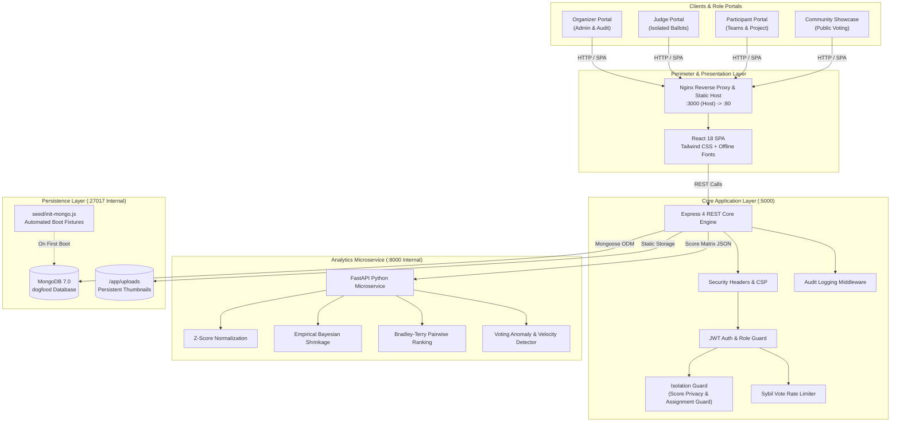

# Dogfood 2026 -- Self-Hosted Air-Gapped Hackathon Platform

---

## 📚 Technical Documentation Deliverables

Detailed technical specifications for the DogFood 2026 hackathon deliverables:

- 🏛️ **[ARCHITECTURE.md](ARCHITECTURE.md)**: System topology, container orchestration, service boundaries, network routing, and offline asset architecture.
- 🗄️ **[DATA-MODEL.md](DATA-MODEL.md)**: Comprehensive Mongoose database schemas, compound unique indexes, TTL policies, and entity relationship diagrams.
- ⚖️ **[JUDGING.md](JUDGING.md)**: Judging subsystem specification, Min-Cost Max-Flow assignment engine, Bayesian Z-score normalization formulas, ballot isolation guards, and quickstart verification.

---

## ⚡ Single-Command Quickstart

The entire platform runs in a dedicated Docker bridge network with a single command from the repository root:

```bash
docker compose up --build
```

### 🌐 Service Port Matrix

| Service                        | Protocol | Port / Accessibility                                                              | Description                                                                    |
| ------------------------------ | -------- | --------------------------------------------------------------------------------- | ------------------------------------------------------------------------------ |
| **Frontend Web Portal**  | HTTP     | [http://localhost:3000](http://localhost:3000) (Host: `3000:80`)                 | React 18 SPA served via Nginx with offline vendored typography                 |
| **Backend REST API**     | HTTP     | [http://localhost:5000/api/v1](http://localhost:5000/api/v1) (Host: `5000:5000`) | Node.js 20 & Express Core API with role-based authorization                    |
| **Judging Microservice** | HTTP     | `http://judging-service:8000` (Internal Docker network only)                    | Python 3.11 & FastAPI statistical analytics service (no host port mapped)      |
| **MongoDB Database**     | TCP      | `mongodb://mongodb:27017/dogfood` (Internal Docker network only)                | MongoDB 7.0 database engine with automatic seed fixtures (no host port mapped) |

> [!NOTE]
> In the Docker Compose topology, only the Frontend (port 3000) and Backend API (port 5000) publish host ports. The Judging Microservice (port 8000) and MongoDB (port 27017) are internal to `dogfood-net`. Host URLs `http://localhost:8000` and `mongodb://localhost:27017` apply only when running bare-metal on the host machine outside Docker.

### 🩺 Healthcheck Endpoints

- **Core API Health (Host-Accessible):** [http://localhost:5000/api/v1/health](http://localhost:5000/api/v1/health)
- **Judging Service Health (Internal):** `http://judging-service:8000/health` (or `http://localhost:8000/health` in bare-metal host dev)

---

## 🔄 Automated Seed Initialization & Scratch DB Reset

The database automatically initializes upon cold start from [`seed/init-mongo.js`](seed/init-mongo.js) via Docker's `/docker-entrypoint-initdb.d/` hook.

### Instantaneous Reset & Seed Verification

To reset scratch databases and verify fixture generation locally without Docker:

```powershell
# 1. Clean scratch databases
mongosh dogfood --eval "db.dropDatabase()"

# 2. Instantaneous seed execution (< 1 second)
mongosh seed/init-mongo.js
```

### Local Bare-Metal Development (Alternative to Docker)

If running services directly on host:

```bash
# Terminal 1: Seed MongoDB
mongosh seed/init-mongo.js

# Terminal 2: Judging Analytics Microservice
cd judging-service
pip install -r requirements.txt
python -m uvicorn app.main:app --port 8000 --reload

# Terminal 3: Backend REST Core
cd backend
npm install
npm run dev

# Terminal 4: Frontend SPA
cd frontend
npm install
npm run dev
```

---

## 🔑 Pre-Seeded Default Accounts

All pre-seeded fixtures share the tournament master password:
👉 **`Raptor2026!`**

| Role                         | Account Name           | Email                           | Focus / Permissions                                                                                                |
| ---------------------------- | ---------------------- | ------------------------------- | ------------------------------------------------------------------------------------------------------------------ |
| **Organizer**          | Tournament Organizer   | `organizer@dogfood.local`     | Platform Admin, Rubric Configuration & Locking, Judge Assignment, Score Normalization, CSV/JSON Export, Audit Logs |
| **Judge (AI/ML)**      | Dr. Elena Rostova      | `judge.ai@dogfood.local`      | Scoring & evaluating AI/ML track submissions                                                                       |
| **Judge (Web3)**       | Satoshi Vance          | `judge.web3@dogfood.local`    | Scoring & evaluating Web3 & Blockchain track submissions                                                           |
| **Judge (FinTech)**    | Marcus Sterling        | `judge.fintech@dogfood.local` | Scoring & evaluating FinTech track submissions                                                                     |
| **Judge (HealthTech)** | Dr. Clara Chen         | `judge.health@dogfood.local`  | Scoring & evaluating HealthTech track submissions                                                                  |
| **Participant**        | Alex Rivera (Captain)  | `alex@dogfood.local`          | Team Captain of**CyberDinos** (AI/ML track, Join Code: `RAPTOR`)                                           |
| **Participant**        | Sarah Connor           | `sarah@dogfood.local`         | Member of**CyberDinos**                                                                                      |
| **Participant**        | David Kim              | `david@dogfood.local`         | Member of**CyberDinos**                                                                                      |
| **Participant**        | Maria Garcia (Captain) | `maria@dogfood.local`         | Team Captain of**BioPulse** (HealthTech track, Join Code: `PULSE1`)                                        |
| **Participant**        | James Wilson           | `james@dogfood.local`         | Member of**BioPulse**                                                                                        |
| **Participant**        | Priya Patel            | `priya@dogfood.local`         | Member of**BioPulse**                                                                                        |

### Pre-Configured Seed Fixtures

- **Event:** `Hackathon Raptors 2026` (Active, 4 Rubric Criteria: Technical Execution [30%], Innovation & Originality [25%], Practical Impact [25%], Polish & Presentation [20%]).
- **Projects:**
  - `Neural Raptor` (Track: AI/ML, Team: CyberDinos, 12 community votes).
  - `HealthSync Pulse` (Track: HealthTech, Team: BioPulse, 8 community votes).
- **Assigned Queues:** Active judge assignments for AI/ML and HealthTech submissions.

---

## 🏛️ System Architecture



### 📂 Repository File Structure

```text
DogFood Hackathon Main/
├── docker-compose.yml          # Multi-container orchestration (172.28.0.0/16 bridge network)
├── .env.example                # Canonical environment template
├── .dogfood.toml               # Benchmark & specification descriptor
├── README.md                   # System documentation & operations guide
├── ARCHITECTURE.md             # System architecture & container topology deliverable
├── DATA-MODEL.md               # Data model & schema deliverable
├── JUDGING.md                  # Judging subsystem specification deliverable
├── acceptance-report.txt       # Automated verification report
│
├── seed/                       # Fixture Generation
│   └── init-mongo.js           # Instantaneous idempotent seed script
│
├── backend/                    # Node.js 20 & Express REST Core
│   ├── src/
│   │   ├── config/             # DB, JWT, and Multer disk storage config
│   │   ├── controllers/        # Auth, Team, Submission, Judging, Admin, Vote
│   │   ├── middleware/         # roleGuard, isolationGuard, rateLimiter, errorHandlers
│   │   ├── models/             # Mongoose schemas (User, Team, Submission, Score, AuditLog, etc.)
│   │   ├── routes/             # REST route endpoints (/auth, /teams, /submissions, etc.)
│   │   ├── services/           # Judge assignment solver, FastAPI client, CSV/JSON exporter
│   │   └── index.js            # Express application bootstrap & security policy
│   ├── tests/                  # 22 Jest test suites (unit, integration & security)
│   └── Dockerfile              # Production Node.js container
│
├── judging-service/            # Python 3.11 & FastAPI Analytics Microservice
│   ├── app/
│   │   ├── algorithms/         # Z-Score, Bayesian shrinkage, Bradley-Terry, Anomaly detection
│   │   ├── models/             # Pydantic validation schemas
│   │   ├── routes/             # /api/v1/normalize, /health, /pairwise-rank, /judge-diagnostics, etc.
│   │   └── main.py             # FastAPI entrypoint
│   ├── tests/                  # Pytest verification test suite
│   └── Dockerfile              # Python ASGI container
│
└── frontend/                   # React 18 SPA (Vite + Tailwind CSS)
    ├── src/
    │   ├── components/         # Navbar, RubricSlider, LeaderboardTable, ProjectCard, etc.
    │   ├── context/            # AuthContext, NotificationContext
    │   ├── pages/              # Gallery, SubmissionEditor, JudgePortal, AdminDashboard, etc.
    │   ├── services/           # Axios HTTP client
    │   └── App.jsx             # React Router v6 navigation
    └── Dockerfile              # Multi-stage Nginx static web server
```

---

## 📡 REST API & Endpoint Summary

All platform API endpoints are mounted under `/api/v1`:

### 1. Authentication (`/api/v1/auth`)

| Method   | Endpoint                  | Access        | Description                                                           |
| -------- | ------------------------- | ------------- | --------------------------------------------------------------------- |
| `POST` | `/api/v1/auth/register` | Public        | Register new user (`participant` role by default)                   |
| `POST` | `/api/v1/auth/login`    | Public        | Authenticate user, return JWT access token & HTTP-only refresh cookie |
| `GET`  | `/api/v1/auth/me`       | Authenticated | Return authenticated user identity, role, and assigned team           |
| `POST` | `/api/v1/auth/logout`   | Authenticated | Invalidate refresh token cookie and terminate session                 |

### 2. Team Management (`/api/v1/teams`)

| Method     | Endpoint                          | Access          | Description                                                  |
| ---------- | --------------------------------- | --------------- | ------------------------------------------------------------ |
| `POST`   | `/api/v1/teams`                 | Participant     | Create team with auto-generated alphanumeric`joinCode`     |
| `POST`   | `/api/v1/teams/join`            | Participant     | Join existing team using 6-character`joinCode`             |
| `GET`    | `/api/v1/teams/my-team`         | Authenticated   | Retrieve member list, captain details, and submission status |
| `DELETE` | `/api/v1/teams/members/:userId` | Captain / Admin | Remove team member or leave team                             |

### 3. Submissions & Project Gallery (`/api/v1/submissions`)

| Method   | Endpoint                                 | Access       | Description                                                                                    |
| -------- | ---------------------------------------- | ------------ | ---------------------------------------------------------------------------------------------- |
| `GET`  | `/api/v1/submissions/public`           | Public       | Paginated list of finalized public submissions with query/track filter                         |
| `GET`  | `/api/v1/submissions/gallery`          | Public       | Visual gallery of active tournament submissions with text search                               |
| `GET`  | `/api/v1/submissions/leaderboard`      | Public       | Public tournament leaderboard standings (unauthenticated; delegates to leaderboard controller) |
| `GET`  | `/api/v1/submissions/:id`              | Public       | Fetch submission detail, description markdown, and thumbnail                                   |
| `GET`  | `/api/v1/submissions/my-submission`    | Team Member  | Retrieve active team's draft or finalized submission                                           |
| `POST` | `/api/v1/submissions`                  | Team Member  | Create or update draft submission details                                                      |
| `POST` | `/api/v1/submissions/upload-thumbnail` | Team Member  | Multipart upload project thumbnail (JPEG/PNG/WebP, max 5MB)                                    |
| `POST` | `/api/v1/submissions/finalize`         | Team Captain | Lock and finalize project submission before deadline                                           |
| `POST` | `/api/v1/submissions/:id/finalize`     | Team Captain | Finalize project submission by explicit ID                                                     |

### 4. Judging & Ballots (`/api/v1/judging`)

| Method   | Endpoint                                 | Access           | Description                                                                                  |
| -------- | ---------------------------------------- | ---------------- | -------------------------------------------------------------------------------------------- |
| `GET`  | `/api/v1/judging/rubric`               | Authenticated    | Fetch active tournament rubric criteria, weights, and scale bounds                           |
| `GET`  | `/api/v1/judging/assigned`             | Judge            | Retrieve judge's assigned submission queue for their tracks                                  |
| `POST` | `/api/v1/judging/scores`               | Judge (Assigned) | Submit final score ballot (enforced by`isolationGuard` active assignment verification)     |
| `PUT`  | `/api/v1/judging/scores/draft`         | Judge (Assigned) | Auto-save draft evaluation (status:`in_progress`; rejects updates if already completed)    |
| `GET`  | `/api/v1/judging/scores/:submissionId` | Judge (Assigned) | Retrieve judge's own score ballot (strips competitor scores; verified by score ownership)    |
| `POST` | `/api/v1/judging/pairwise`             | Judge            | Record head-to-head comparison between two projects (bypasses single-submission queue check) |
| `GET`  | `/api/v1/judging/pairwise`             | Judge            | Fetch recorded pairwise comparisons for track                                                |
| `POST` | `/api/v1/judging/auto-evaluate`        | Judge            | Auto-evaluate remaining queue items using rubric median scores (5.0)                         |

### 5. Tournament Administration (`/api/v1/admin`)

| Method       | Endpoint                                   | Access    | Description                                                                                                     |
| ------------ | ------------------------------------------ | --------- | --------------------------------------------------------------------------------------------------------------- |
| `POST`     | `/api/v1/admin/assign-judges`            | Organizer | Global Min-Cost Max-Flow assignment solver enforcing track competency, balance, and quorum                      |
| `GET`      | `/api/v1/admin/assignments`              | Organizer | Inspect all active judge assignments across submissions                                                         |
| `POST`     | `/api/v1/admin/normalize-scores`         | Organizer | Dispatch scores to FastAPI service (`POST /api/v1/normalize`); failover to in-process fallback if unreachable |
| `GET`      | `/api/v1/admin/leaderboard`              | Organizer | Ranked leaderboard with raw averages, normalized scores, and Z-scores (requires organizer role)                 |
| `GET`      | `/api/v1/admin/export/csv`               | Organizer | Stream RFC 4180 CSV export of final tournament scores and rankings                                              |
| `GET`      | `/api/v1/admin/export/json`              | Organizer | Export structured JSON tournament evaluation dump                                                               |
| `GET`      | `/api/v1/admin/audit-logs`               | Organizer | Query application-level audit trail of score modifications and administrative actions                           |
| `GET`      | `/api/v1/admin/stats`                    | Organizer | Aggregate statistics (teams count, submission rate, judging completion %)                                       |
| `GET`      | `/api/v1/admin/analytics`                | Organizer | Detailed track breakdown, score variances, and judge calibration metrics                                        |
| `GET/POST` | `/api/v1/admin/rubric`                   | Organizer | Read or update tournament evaluation criteria and weights (enforces$\sum w = 1.0$)                            |
| `POST`     | `/api/v1/admin/lock-rubric`              | Organizer | Lock rubric configuration against further edits once evaluations begin                                          |
| `PUT`      | `/api/v1/admin/scores/:scoreId/override` | Organizer | Override anomalous score with mandatory audit reason logging                                                    |
| `PUT`      | `/api/v1/admin/users/:userId/role`       | Organizer | Elevate or modify user permission role                                                                          |

### 6. Community Voting (`/api/v1/votes`)

| Method     | Endpoint                        | Access                | Description                                                               |
| ---------- | ------------------------------- | --------------------- | ------------------------------------------------------------------------- |
| `POST`   | `/api/v1/votes/:submissionId` | Public / Rate-Limited | Cast community vote for project (SHA-256 fingerprint hash, 24h TTL index) |
| `DELETE` | `/api/v1/votes/:submissionId` | Public / Rate-Limited | Revoke / cancel cast community vote                                       |
| `GET`    | `/api/v1/votes/:submissionId` | Public                | Check whether client has already voted for submission                     |

### 7. Internal Judging Analytics Microservice (`:8000`)

*These internal microservice endpoints are invoked over the Docker network bridge by the Node backend and are not exposed directly on the host in production compose topology:*

| Method   | Endpoint                      | Description                                                                                                               |
| -------- | ----------------------------- | ------------------------------------------------------------------------------------------------------------------------- |
| `GET`  | `/health`                   | Service health status and uptime                                                                                          |
| `POST` | `/api/v1/normalize`         | Primary normalization: Z-score with Empirical Bayesian shrinkage prior calibration ($K=3.0$) and Min-Max 0–100 scaling |
| `POST` | `/api/v1/judge-diagnostics` | Statistical judge profiling: severity classification (Strict, Balanced, Lenient) and standard error of the mean (SEM)     |
| `POST` | `/api/v1/pairwise-rank`     | Minorize-Maximization (MM) Bradley-Terry preference ranking over connected comparison graphs                              |
| `POST` | `/api/v1/voting-anomalies`  | Tournament-wide voting anomaly detector: 3-sigma velocity threshold and User-Agent Shannon entropy                        |

*(Note: The single-submission anomaly detector `detect_voting_anomalies()` in `app/algorithms/anomaly_detector.py` is a standalone internal utility and is intentionally unmounted from the production API router; tests explicitly verify `/api/v1/detect-anomaly` returns 404).*

---

## 🔒 Security & Air-Gap Hardening

- **Offline-First Runtime:** The application operates without external runtime APIs, CDNs, or telemetry. All assets, including Inter typography (`frontend/public/fonts/`), are completely vendored offline.
- **Network Topology:** Services communicate via a dedicated Docker bridge network (`dogfood-net`). Container egress blocking has been verified through container test probes (`nc -zv -w 2 8.8.8.8 53`). Note that building Docker images requires package/image availability unless Docker layers and dependencies are pre-cached.
- **Score Isolation (`isolationGuard`):** Express middleware intercepts `/api/v1/judging/*` requests, strictly verifying an active `JudgeAssignment` exists for the authenticated judge before permitting access. Peer evaluations are stripped, and single-submission isolation is explicitly bypassed for the pairwise comparison route.
- **Score Ownership Enforcement:** Judges are prevented from inspecting another judge's score ballots through strict ownership validation in `verifyScoreOwnership`.
- **Application-Level Audit Trail:** Sensitive mutations (score submissions, rubric locking, score overrides, role elevations) write chronological audit records to MongoDB `AuditLog`.
- **Sybil Resistance:** Community voting uses SHA-256 IP + User-Agent fingerprint hashing, a 24-hour MongoDB TTL index, and token-bucket sliding-window rate limiting (5 requests/minute per IP).

---

## 🧪 Verification Status

### Latest Verified State

- **Backend REST API**: 22 Jest test suites verified passing comprehensive unit, integration, and security coverage.
- **Judging Analytics Microservice**: 169 passing pytest tests (1 environment cache warning, 0 code defects) verified in 1.52s (WBS-53 fresh verification).
- **Docker Compose Topology**: All 4 services healthy (`dogfood-mongodb`, `dogfood-judging`, `dogfood-api`, `dogfood-frontend`) in single-command boot (WBS-56).
- **Mathematical & Algorithmic Invariants**: Verified determinism across normalization (Z-score + Bayesian shrinkage, 97.87% variance reduction), Bradley-Terry MM convergence, judge diagnostics severity/SEM, and dual-layer anomaly detection (WBS-44, WBS-53, WBS-56).
- **Air-Gap / Egress Verification**: Zero external runtime network requests, offline font delivery, TCP egress blocked (`nc -zv -w 2 8.8.8.8 53` exit check).

*Historical verification milestones (e.g. initial 74-test and 125-test passes, WBS-44, WBS-53) and complete execution logs remain archived in `acceptance-report.txt`.*

### Test Suite Execution Commands

```bash
# 1. Run Node.js REST API test suites
cd backend
npm test

# 2. Run Python Judging Analytics tests
cd ../judging-service
pytest tests

# 3. Verify Docker network air-gapped egress isolation
docker exec dogfood-api sh -c "nc -zv -w 2 8.8.8.8 53 || echo 'Egress Successfully Blocked'"
```

---

## 🏷️ Release & Specification

Specification version: **`1.0.0`** (conforming to `.dogfood.toml`).
Target event: **`Hackathon Raptors 2026`**.
